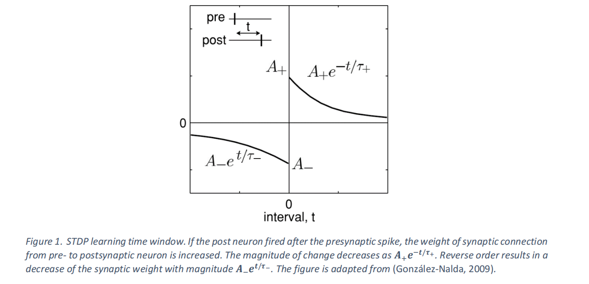
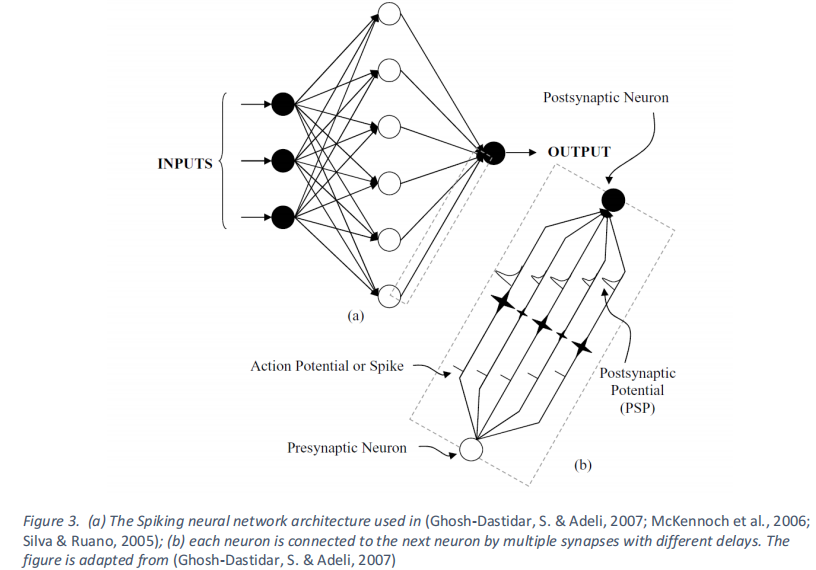
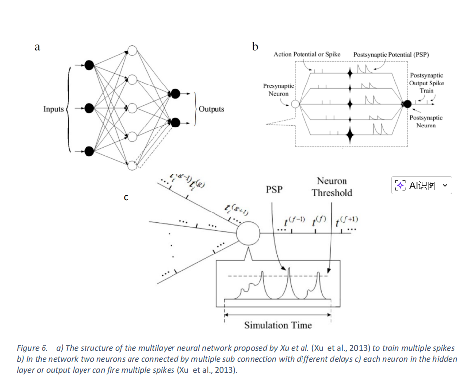
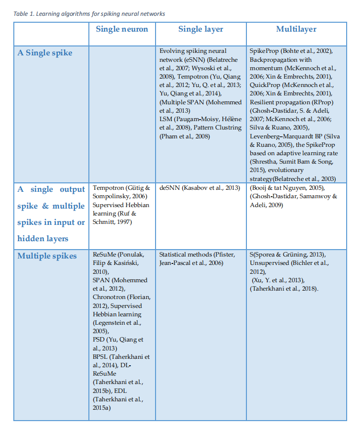

# SNNoverall


本文的原文地址：[A review of learning in biologically plausible spiking neural networks](https://www.sciencedirect.com/science/article/abs/pii/S0893608019303181)。

    -  论文发表时间：2020.2

## 0. introduction

- 前情提要：ANN的灵感本来就来源于生物神经系统，但是和生物神经元相比，人工神经网络的抽象程度高，且无法捕捉生物神经元复杂的动态时间特性，这个就是SNN的诞生契机。

- 由于SNN能够捕捉生物学原理的神经元丰富的动态特征，并且表示成和时间、频率和相位等不同信息维度，因此它们提供了一种非常有前景的计算模式，并且可能模拟出大脑中复杂的信息处理过程

    - SNN还有处理海量数据和利用脉冲序列进行信息表示的潜力

    - SNN也是培育低功耗硬件

- SNN中的时间编码

    - 传统观点认为是频率编码→$Information∝firing \text{ } rate$

    - 问题在于这和人类大脑处理信息的速度有很大不同

        - 比如说视觉神经中$10层神经元\times 10ms反应时间$$=100ms$

        - 如果使用频率编码就要统计一段时间内的spike数量，需要100 ms 或更长的时间才能统计频率，从而导致没有足够时间计算频率

    - 所以可以使用$\text{spike timing coding }$

        两个神经元：

        ```C++
        Neuron A: spike at 10 ms
        Neuron B: spike at 12 ms
        ```

        这种 **相对时间差** 本身就携带信息。

        这种编码方式叫：**Temporal coding（时间编码）**

        或者：**Time-to-first-spike coding**

    - 使用时间编码的优势

        - 更快：只需要一个spike就可以传递信息

        - 更省能量：频率编码需要很多spike，但是时间编码只需要几个spike就可以了

- 新的研究进展：

    - 生物学家发现多种形式的生物突触可塑性→是由神经元放电调控的。

    - 这个和不同形式的突触权重和延迟学习的SNN模型是相符的


## 1. 回顾SNN学习算法的生物学背景

神经元通过突触相互连接，形成复杂的结构。文献综述表明，设计脉冲神经网络（SNN）学习算法时需要考虑的重要因素包括：神经元模型、突触通信、网络拓扑结构以及信息。

### 1.1 SNN神经元模型

#### 1.1.1 Hodgkin–Huxley 模型（1952）

最真实的生物学模型：**4维微分方程、**描述离子通道电导、能真实复现神经电生理行为

$$
C\frac{dV}{dt​}=I−g_{N_a}​m^3h(V−E_{N_a}​)−g_K​n^4(V−E_K​)−g_L​(V−E_L​)
$$

- 优点就是生物真实性高

- 缺点就是计算量大

- 所以不适合大规模SNN

所以我们需要的是简化模型


#### 1.1.2 LIF（Leaky Integrate-and-Fire）

是常见的SNN神经元

模型：

$$
τ_m\frac{dv_m(t)}{dt}​=−(v_m(t)−E_r​)+R_mI(t)
$$

- $v_m(t)$：膜电位

- $E_r$：静息电位

- $\tau_m$：膜时间常数

- $R_m$：膜电阻

- $I(t)$：输入电流


#### **（1）直观理解：**

- **漏电：**

    - $−(v_m(t)−E_r​)$

    - 意思就是如果膜电位高于静息电位，电压就往回掉→类似于漏电电容$leaky$

- **输入电流**：

    - $R_m​I(t)$

    - 表示：突触输入→电流→提高膜电位


#### （2）输入电流的计算：

$$
I(t)=W⋅S(t)
$$

其中$W=[w_1​,w_2​,...,w_N​]$表示突触权重。

而$S(t)=[s_1​(t),s_2​(t),...,s_N​(t)]$表示输入spike信号

含义就是每个输入神经元：$spike\times weight$ 贡献一个电流


#### （3）spike train 

$$
s_i​(t)=∑_f ​δ(t−ti^f​)
$$

- $ti^f​$：第f和spike的时间

- $δ$：Dirac函数

为什么要使用$δ$? 因为spike实在某个精准事件发生的瞬时时间

```C++
电压
  ^
  |      /\ 
  |     /  \ 
  |____/    \____
        t0
```

```C++
time →
      |
      |
      |
```

只保留：spike发生的时间。这就是 $δ$ 函数。


#### （4）神经元何时释放spike

当膜电位达到阈值：

$$
v_m(t) \geq V_{th}
$$

神经元产生：output spike；然后reset回到$E_r$这个电位上

之后短时间内不能再发spike，这段时间：$t_{ref}$叫做**refractory period(不应期)**


#### （5）整体流程总结

```C++
输入spikes
     ↓
突触权重加权
     ↓
产生电流 I(t)
     ↓
膜电位动态变化
     ↓
达到阈值
     ↓
产生spike
     ↓
reset + refractory
```


输入电流的计算：


当：

$$
V>V_{threshold​}
$$

时，就会产生spike，然后reset

- 优点是非常简单，计算快

- 缺点是生物真实性较低


#### 1.1.3 SRM（Spike Response Model）

这个也是一种简化模型

特点：用核函数描述 spike 对膜电位的影响

---

### 1.2 神经元如何处理输入 spike

#### 1.2.1 Integrator（积分型神经元）

机制上就是：输入spike→累加

神经元会在较长时间窗口内输入：

$$
V(t)=∑PSP_i​(t)
$$

只要超过总和阈值就可以了。

特点：

- 时间窗口较长

- 对 spike 精确时间不敏感

合适：rate coding


#### 1.2.2 Coincidence Detector（同步检测）

CD神经元只对同时到达的spike敏感。

如果两个spike时间差很小：$Δt<ϵ$ 就会触发spike。

特点：

- 对 **时间非常敏感**

- 适合 **temporal coding**


这个在生物学中相关的对应内容就是听力定位等等

---

### 1.3 SNN的学习机制——突触可塑性（Synaptic Plasticity）

#### 1.3.1 什么是突触可塑性与学习的关系

之所以需要进行突触的改变：

**突触强度（weight）会根据神经元活动发生改变**

也就是说

$$
w_{ij}​→w_{ij}​+Δw
$$

所以我们在这里的学习就是改变连接的强度


#### 1.3.2 学习种类

| 类型 | 含义 |  |
| --- | --- | --- |
| Unsupervised | 无标签，靠局部规则 |  |
| Supervised | 有目标信号 |  |
| Reinforcement | 奖励驱动 |  |

重点在于unsupervised


#### 1.3.2.1 Unsupervised learning

learning is based on local events

```SQL
每个突触只看：
- pre neuron 有没有发 spike
- post neuron 有没有发 spike
- 它们的时间关系
```

#### （1） 无监督学习的本质机制

可以抽象成：

$$
Δw=f(\text{pre spike,post spike,t})
$$

这也就是：权重变化=spike之间的关系

#### （2）Hebbian learning

核心的经典规则就是：**Cells that fire together wire together**

也就是说：同时激活→连接增强

即：A经常触发→B也跟着触发

那么：A→B的连接变强

#### （3）STDP：无监督学习的具体实现

- spike timing dependent plasicity：基于脉冲时间的突触可塑性

$$
t=t_{post}​−t_{pre}​
$$

即：按照时间顺序来决定是增强还是减弱

**情况1：pre在前（因果）**

- 学习规则

$$
\text{如果t>0   (即pre在前)}
$$

$$
Δw=A_+​e^{−t/τ+}​
$$

权重增加（LTP）

**情况 2：post 在前（非因果）**

- 学习规则

$$
t<0
$$

$$
Δw=−A_−​e^{t/τ−}​
$$

权重减小

STDP其实是在学习：谁更像原因→谁就会被加强




#### （4）怎么做到classification

输入就是有一个结果，然后强化对自己有因果关系那个输入模式

这样就可以达到一个神经元=一个模式的关系(这个也不一定，反正相近的模式有可能内分到一个神经元上面)

```SQL
输入 → STDP → 神经元自己变成 feature
```

也就是：STDP 通过“谁先触发谁”来强化连接，使不同神经元专门响应不同输入模式，从而实现“自动分类”。


#### 1.3.2.2 监督学习（Supervised learning）

大脑中可能有指导信号，来自于感觉反馈和其它神经元群

小脑的监督学习的重要位置，是大脑的“误差矫正系统”

核心机制：强链接——带动其它的连接学习

```SQL
A1 → 很强（老师）
A2 → 很弱（学生）
```

当A1触发B产生spike，B被“老师”强行激活

然后stdp发生，看A2的前后发生顺序，决定激活 or 削弱

```SQL
输入 spike
     ↓
teacher neuron（控制输出）
     ↓
post spike 被固定
     ↓
STDP 更新连接
     ↓
网络逐渐学会正确映射
```


#### 1.3.2.3 强化学习Reinforcement learning

在STDP上面叠加一层奖励，用来放大或抑制STDP的学习方向

权重变成：$Δw=STDP×reward$


#### 1.3.2.4 延迟学习Delay learning

相较于传统的神经网络只学习$w$，SNN可以学$(w,d)$

这个delay learning是在教系统自动学会对齐时间，从而达到**coincidence detection**的条件

只是用STDP的缺点就是只会寻找单个的强特点，而不是整体的特点


```SQL
spike timing
      ↓
coincidence detection
      ↓
STDP（基础学习）
      ↓
+ teacher → supervised
+ reward  → reinforcement
+ delay   → timing alignment
```


#### 1.3.3 信息编码（information encoding）

神经元使用spike传递信息，但是这个信息到底在哪里

#### （1）rate coding 

信息来自于发送了多少次spike

$$
information∝firing rate
$$

#### （2）temporal coding

信息来自于发送的时间

顺序/时间差 本身就是信息

特点：非常快速/信息密度高/更加接近生物大脑

而且我们上面提到的STDP、coincidence decection、delay learning非常依赖timing

temporal coding的几种方式：

- time-to-first-spike——谁先发，就代表信息重要

- Rank-order coding（ROC）——看第几个发，自定义那个重要。不好！一点噪音顺序就改变

- Synchrony（同步编码）——一起发，代表一个特征

- Phase coding / latency coding——本质上都是时间差编码

- Polychronization——一组神经元在不同时间精准配合


#### 1.3.4 SNN的拓扑结构

拓扑结构简单理解就是：这些神经元是怎么连接在一起的

#### 1.3.4.1 三种拓扑的连接结构

**（1）feed-forward**

输入→中间层→输出

**（2）Recurrent**

    A → B → C

    ↑              ↓

    ← ← ← ←

网络是有记忆的，过去的状态会影响现在

**（3）hybrid**

混合状态，因为不同任务需要不同的能力

- 前馈 → 快速处理

- 循环 → 长期依赖


#### 1.3.4.2 生物大脑的结构

大脑不是简单的网络，而是clustered network（簇结构）

- 簇结构是指神经元被分成很多“团”

- 每个团内部连接很紧密

- 不同团直接通过“hub”连接

**scale-free network（无标度网络）**

特点：

- 少数节点连接很多（hub）

- 多数节点连接很少

就和互联网一样

生物意义上就是高效+稳定+抗干扰


拓扑结构是“连接方式”，而 scale-free 是“连接数量分布的规律”，两者是不同层面的概念，但可以同时存在。


#### 1.3.4.3 拓扑的变化

因为大脑的特点是：核心区域很稳定，边缘区域经常变化

所以SNN中也有一种模型叫做：evolving SNN（演化网络）

**evolving SNN（演化网络）：**

- 这个模型不仅仅学习经典的的权重w，还学习连接关系，甚至会长出新的连接/旧的连接删除


## 2. 学习算法的重要组成部分

### 2.1. Learning a single spike per neuron

#### （1）spikeprop

有点类似由于强行将ANN的训练方法搬运到SNN上面，区别就是在SNN里面的spike是不连续的，所以梯度不好算

会出现局部最优和有些神经元不发的效果

#### **spikeprop与CNN的区别和问题在于：**

- 神经元输出的是离散时间，

- 这种发放过程通常是不可导或者很难求导的

| ANN | SpikeProp |
| --- | --- |
| 输出是数值 | 输出是 spike 时间 |
| loss = 数值误差 | loss = 时间误差 |
| 反向传播 | 反向传播 |


#### **SpikeProp的解决方法：**

- 不要对脉冲本身进行求导

- 而是对脉冲发放的**时间**进行求导

- 然后用这个近似梯度做类似的BP训练

所以说SpikeProd就是把反向传播改造后，用在‘脉冲发放时间’上的方法


#### spikeprop的基本内容

SpikeProp 的灵感来源于经典的反向传播算法。SpikeProp 是一种多层脉冲神经网络，已成功应用于分类问题。在该网络中，两个神经元通过具有不同权重和延迟的多条连接相互连接(见下图)。


图b中，我们可以看到，一个神经元产生的spike可以被不同的管道，因为不同的PSP，再到达下一个神经元。最后这个接受的神经元的最终输出就是所有PSP的时间叠加的最终结果


与其它基于梯度的方法类似，SpikeProp 也基于误差函数梯度的估计，因此存在局部最小值问题。此外，静默神经元或不激活神经元的存在也会阻碍梯度的计算（这个的意思就是有时候 spike 根本没有发出相关的信号，我们的梯度链条可能会断掉。这个训练目标依赖于 spike time，没有 spike time 就没有梯度入口）。


#### spikeprop的改进

- Back-propagation with momentum

- QuickProp

- RProp

- Levenberg–Marquardt BP

- adaptive learning rate 的 SpikeProp 变体

这些方法是在改进：收敛速度、稳定性、学习率、梯度更新效率、对局部极小值的鲁棒性


#### spikeprop的模型假设的限制

模型假设每个神经元只发一个spike。

因为如果发了很多的spike，我们就要找spike的关系，再计算上就会变得非常复杂

所以只发一个spike我们就可以简化成：

$$
E=\frac{1}{2}​∑_j​(t_j​−t_j^d​)^2
$$

- $t_j$：实际发放时间

- $t_j^d$：期望发放时间

这样我们的反向传播就更加容易建立


spikeprop与神经元模型绑定很深，每次换一个神经元模型（SRM、LIF等）对应的膜电位，阈值等所有的形式都不一样，所以一定发生改变


因为这个局限性，有人采用进化策略训练突触权重和延迟，和spikeprop相比，该方法性能良好，但是训练算法耗时较长


#### （2）SOM-like SNN(自组织映射)

基于自组织（Self-Organizing）+ Hebbian + delay 学习的 SNN 聚类模型。

核心思想是：不学习“权重”，而是学习delay，让输入spike在时间上对齐，从而触发某些神经元→实现聚类


[详细的流程](./SNNoverall-assets/detailed-process.md)

这样子，通过循环，相似输入会把同一片区域一起塑形，因此映射成相邻神经元。


#### （3） eSNN(evolving SNN)

结构是会变化的，使网络会自己长大，所用的编码就是SOC，并只看第一个spike

问题是：忽略了后面的spike，丢掉了temporal信息，表达能力弱


eSNN是基于Hebbian learning的，也就是说类似于“一起活动的神经元，连接会加强”这种思路；比较适合online learning，不需要像普通深度网络那样将整个数据集反复训练很多轮；先将输入编码成spike timing（谁先发spike，谁后发spike的顺序来表示信息）


evolving主要是指：当先输入样本到来的时候，网络不会只是按照固定参数去计算。网络会根据样本决定（让已有的神经元代表这个模式or新建一个神经元来表示一个新的输入模式），所以是会evolving的。

批评了eSNN的重点，只利用每个输入突触上的first spike，后面的spike基本忽略。


L1：contrast cells（初级对比检测，比如亮暗变化、局部刺激）

L2：orientation cells（这一层像是在检测方向特征，比如横线、竖线、斜线）

L3：complex cells（主要的学习发生在这里）

L4：Class（这一层是分类输出层，把 L3 的结果整合起来，输出类别 1、类别 2 等）

在L3中输入编码和学习主要依赖于first spike / rank order，所以这个是eSNN的主要缺陷


#### （3）deSNN

在eSNN的基础上进行改变。

我们在上面可以看到，原始的eSNN只用first spike，忽略后续的spike，从而它的表达能力是有限的，尤其是编码复杂的脉冲式模式

#### Rank Order learing

仍然保留Rank Order learing，也就是

$$
w_i^{init}​∝rank(t_i^{first}​)
$$

谁先spike→初始权重大

谁后spike→初始权重小

这一部分负责快速建立初始模式

#### SDSP

加入了Spike Driven Synaptic Plasticity，也就是deSNN的关键

**规则1：收到spike→权重增强**

$$
\text{if spike arrives}: w↑
$$

**规则2：没有收到spike→权重减弱**

$$
\text{if no spike: w↓}
$$

因为这个会依赖后面的spike的发生，所以很好的规避了eSNN的问题


整体看来，就是我们先用rank-first的方式，得到一个基础的w，之后使用SDSP的方式继续对w进行微调


eSNN/deSNN的神经元模型不是标准的生物模型，而是“基于顺序”的简化模型。

它和神经元的标准模型的区别在于：

- 只关系spike的先后顺序，不关心精确时间间隔、连续时间动力学

- no leakage in PSP

    - 正常的LIF模型是：$τ\frac{du​}{dt}=−u+∑inputs$

    - 这个里面有个-u的**泄露**


#### （5）Tempotron

是一个有监督学习的SNN neuron，用于做二分类

做分类（0/1）

核心规则就是如果和预期不符，就削弱权重，反之增加

局限在于只能做简单分类，扩展性差

改进：

Encoding→Trempotron→readout

特点：使用每个latency coding，每个neuron只发一个spike


#### 现有单脉冲方法的共同问题：

1. eSNN / deSNN
→ 不是真正的生物动力学模型（无 leakage）

2. Tempotron
→ 只能二分类

3. Yu 方法
→ 仍然 single spike


### 2.2 Learning multiple spikes in a single neuron or a single layer of neurons

[总结](./SNNoverall-assets/summary.md)

上面2.1中提到的eSNN/deSNN,Tempotron,Yu等方法都有各自的缺点，因为这些方法有共同的制约：输出是single spike

所以它们：表达能力有限且时序信息利用的不充分

多个spike可以很好的丰富信息，从而得到正确的表达信息的方式。

multiple spikes 不仅表示“有没有发放”，还编码了“什么时候发、发了几次、间隔如何”，因此时间结构本身成为可用信息。

这个也有生物证据支持——斑马鱼，精准spike timing控制动作→也就是说序列本身就是信息。

所以我们需要找到一个让neuron发multiple spikes的学习方法。

#### （1）supervised hebbian

用监督版的Hebbian （类STDP）可以学时间模式，但是有缺陷

但是有两个问题：

1. 不保证收敛（训练可能不稳定，会发散or震荡）

2. 即使已经正确了但是还在修改权重（已经学对了，但是还在更新）

模型不稳定，容易破坏已学的知识

#### （2）statistical methods（统计方法）

用概率方法：$maxP(在目标时间发spike)$

缺点：

1. 难以学习复杂的 spike train

2. 没有实际的应用

#### （3）ReSuMe

是一种监督学习算法，可以训练神经元产生“指定的多spike输出序列”

目标：$输入\text{spike pattern}→期望的输出\text{spike train}$

#### 机制：

1. 基于STDP+anti-STDP

    - STDP：增强正确的时序

    - anti-STDP：抑制错误的时序

1. 引入teacher spike train（核心）

    - 有一个老师信号：目标输出时间序列

    - 模型做法：如果当前输出≠teacher→调整权重

1. 本质上是一个Widrow-Hoff

$$
w←w+η(target−output)
$$

    只是换了spike形式

#### 解决问题：

1. 能生成multiple spikes——不再是single spike

2. 避免了silent neuron的问题——因为现在有了teacher的信号→所以强制激活

3. 保留了生物合理性——序列性质的t

4. 支持online learning

但是ReSuMe依旧是传统的神经网络的范式（调权重）


#### 任务形式：

文中写的是：

$$
S(t)=[s_1(t),s_2(t),...s_N(t)]
$$

这表示输入时N个输入突触上的spike train。

#### 各个符号：

- $s_i(t)$：第i个输入突触上的脉冲序列，即某个输入通道在时间轴上的发放情况

- $s_d(t)$：desired output spike train

    - 也就是teacher希望神经元输出的目标序列

- $s_o(t)$：actual output spike train

    - 这个就是让当前的神经元真实发出来的spike序列，训练目的是：$s_o(t)\approx s_d(t)$

#### 它的核心学习公式

$$
\frac{dω_i(t)}{dt} = [s_d(t)-s_o(t)][a+\int_{0}^{+∞​}T_W(s)s_i(t-s)ds]
$$

- 外层$s_d(t)-s_o(t)$表示当前时刻t，到底应该鼓励增强，还是鼓励减权

- 内层$a+\int_{0}^{+∞​}T_W(s)s_i(t-s)ds$表示第i个输入突触，对当前时刻的学习更新应该贡献多少

    - $a$：这个的作用是做一个整体偏差预修正项

        - 如果实际输出spike数量比目标多，那么这个项倾向于整体减权

        - 如果实际输出spike数量比目标多，那么这个项倾向于整体增权

        - 如果没有这个项的话，单靠局部STDP型的更新，有时候学习会比较满，因为我峨嵋你只有在具体某个输入spike和某个输出spike做配对

        - 而a提供了一个更加全局的修正，让训练更快

    - $\int_{0}^{+∞​}T_W(s)s_i(t-s)ds$

        - 这个是最核心的“时序相关的部分”

        - 它表示：在当前时刻 t 之前，第 $i$ 个输入突触有没有在不久前发过 spike；如果发过，而且越接近当前时刻，贡献越大。

        $T_W(s) = 
\begin{cases} 
Ae^{-s/\tau}, & s \ge 0 \\ 
0, & s < 0 (\text{这个因果窗口，和未来无关})
\end{cases}$

        - 这一段说明：这是一个指数衰减窗口，距离但概念时刻越近的历史输入spike，影响越大；越早以前的spike，影响越小。

            - A：幅值，控制更新强度。

            - $τ$：时间常数，控制“回看多远”，越大看的就越久


#### 执行逻辑

**（1）当目标spike到来时**

假设目标希望在时刻$t_d$发送spike

那么：$s_d(t_d)=1$

如果这个时候神经元还没有发出对应的输出，就会倾向于增强那些在 $t_d$​ 前不久发过 spike 的输入突触。

因为这些靠近的输入最有可能是“帮助神经元在$t_d$发放”的因果证据链

**（2）当实际输出spike到来时**

假设神经元在$t_o$发了一个不该与的spike

那么$s_o(t_o)=1，s_d(t_o)=0$，这个时候就会倾向于：减弱哪些在$t_o$前不久发过spike的输入提出。

因为这些输入最有可能"导致了这个错误的输出"

**（3）反复训练后的结果**

经过不断的重复就可以做到：

- 该在目标时刻前起作用的输入连接会被增强

- 导致错误发放的输入连接会被削弱


#### 为什么它可以学别人不会的multiple spike?

因为它学习的是$s_d(t)-s_o(t)$，在整条时间轴上的误差在学习，所以只要目标里面有多个spike：$t_1,t_2,t_3$，就会分别在这些时刻附近增强/键入相关连接就会被奖励/惩罚


#### ReSuMe的优缺点：

1. 能学目标spike train——学习的时序的输出

2. 是监督学习——目标明确

3. 有一定生物合理性

4. 能在线学习

#### ReSuMe的局限

1. 任然是基于权重调整——传统的ω的调整范式

2. 时序控制可能比较敏感

3. 多神经元、多层扩展并不天然简单


|  | ReSuMe | eSNN / deSNN |
| --- | --- | --- |
| 输入 | spike trains | spike trains |
| 输出 | spike train（时间序列） | 类别 |
| 学习目标 | 对齐时间序列 | 分类 |
| 是否关注精确时间 | ✔ 非常重要 | ❌ 主要看顺序 |
| 输出形式 | 多 spike | 单 spike / 投票 |
| 本质任务 | temporal regression | classification |


#### （4）SPAN

因为ReSuMe有一个隐含的问题：spike train很难优化（不连续、不可微、很难用标准数学工具），所以SPAN的思路就是将其变成连续的

这个和ReSuMe很相似，基本上就是在ReSuMe的基础上做的，区别在于：

ReSuMe：直接在 spike 上做学习（事件驱动）
SPAN：先把 spike train 变成连续信号，再用“普通数学方法”去学

SPAN将难处理的spike train变成好处理的连续函数

#### step1：先将spike train转换成连续信号：

- 将原始的$s(t)→x(t)$，然后通过卷积：$x(t)=Σ_kκ(t-t_k)$

- 这样就可以将每个 spike 变成一个小凸起，从而叠加成连续的曲线

#### step2：输入输出都变成连续信号

- 输入：$s_i​(t)→x_i​(t)$

- 输出：$s_o​(t)→y(t)$

- 目标：$s_d​(t)→y_d​(t)$

现在的问题就变成了：$y(t)≈y_d(t)$

这样就变成了**函数拟合的问题**

#### step3：用Widrow-Hoff(Δ rule)学习

类似于：

$$
Δw_i​∝∫(y_d​(t)−y(t))x_i​(t)dt
$$

也就是**误差$\times$输入信号**

#### step4：再转会spike


#### SPAN的优点：

- 可以用标准的数学工具

- 更稳定：不想STDP会局部震荡

- 可以处理复杂的spike train 因为是一个整体悉尼号

#### SPAN的限制

- 因为原始的版本只是训练单个neuron，后来2013年才扩展，分类任务仍退化为single spike的问题


- 左边：每一行表示一个neuron，小竖线表示该neuron在某个时间发spike

    - 这整个左边相当于$\{s_1(t),s_2(t),...s_N(t)\}$

- 中间进行

    - step1：spike→连续信号

$$
s_i​(t)→x_i​(t)
$$

    - step2：线性组合

$$
y(t)=∑_iw_i​x_i​(t)
$$

    - step3：匹配目标信号

$$
y(t)≈y_d(t)
$$

- 右上角结果：就是显示随着epoches的增加输出逐渐对齐的过程

- 右下角就是显示我们的error越来越小


#### （5）Chronotron version1 E-learnig

- ReSuMe：局部规则，不是严格优化

- SPAN：转连续，但没有严格对齐 spike 时间

- SpikeProp：梯度难用（不连续）

Chronotron和ReSuMe的区别在于ReSuMe是一个靠经验逼近的，但是这个方法是有一个明确的loss function，定义了$\text{E(output spike train,target spike train)}$

所以这个方法的目标是做精准时间对齐的优化学习

#### **step1：用核函数表示神经元的响应**

使用SRM+kernel function;

因为每个输入的spike都会产生一个PSP：$κ(t−t_i​)$

然后将所有的输出叠加：

$$
u(t)=∑​_iw_i​∑_k​κ(t−t_i^k​)
$$

将spike变成连续信号，现在的神经元状态时连续函数$u(t)$

#### **step 2：定义 normalized PSP（λ）**

$λ_j​(t)$：这个时去掉权重之后的PSP（只有时序）

作用：

- 分离“输入时序结构”和“权重”

- 便于分析和优化

#### **step 3：定义误差函数**

这里考虑了三种错误：

1. 少了spike（insertion error）

2. 多了spike（deletion error）

3. 时间不对（shift error）

权重更新是：

$$
Δw_j​=−\frac{∂E​}{∂w_j}
$$

本质上就是梯度下降。但是梯度时近似的但不是严格解析的


Chronotron不是在做又没有spike，而是把spike从错误的时间移动到正确的时间上面


**困难在哪**

spike不是连续事件$\text{spike = threshold crossing}$

dynamics很复杂：所种spike站之间相互影响、时间依赖强


#### （6）Chronotron I-learning

用ReSuMe的局部规则来近似实现Chronotron version 2

1. 基本思想：如果在目标时间里面发了spike：就会有$\omega$上升；但是如果有不应该发的，就会抑制

2. ReSuMe的区别：ReSuMe使用的是$e^{−t/τ}$

3. I-learning用的是：两个指数之差：$κ(t)=e^{−t/τ_1}​−e^{−t/τ_2}$，也就是我们说的alpha function

    4. $τ_1$：控制上升速度

    5. $τ_2$：控制衰减速度

6. 使用双整数的原因：它是先上升→然后再下降的，有峰值和时间选择性，双指数可以更加精准的刻画“什么时候更重要”​

7. 还有一个要注意的区别是ReSuMe有一个$a(全局变量)$,但是I-learning里面没有这一项；这也意味着更接近严格优化，但是可能会收敛速度慢一点

8. 这个方法适合**单神经元级别的精确时序学习方法**


#### （7）SWAT

SWAT = STDP（时序） + BCM（发放率） → 用发放率来稳定 STDP 的学习，但只能处理 rate coding，不是真正的时间编码方法


STDP（基本的$\text{pre before post⇒w↑}$    $\text{pre after post}⇒w↓$）

BCM 权重更新取决于**post-synaptic raie（方法率）**

BCM不直接更新权重，而是：调节STDP的“学习窗口强度”

即$Δw∝\text{BCM factor}×\text{STDP update}$


BCM是用来稳定学习过程，从而防止SDTP本身容易发散、不稳定的问题

基本流程：

$$
\text{spike timing} →$ $\text{rate →filter}（是一个隐藏层，对输入的发放率做滤波/特征提取）
$$

→$分类$


**缺点：**

缺点就来源于这个rate coding：

因为SWAT不建模时间结构，只单纯保留spike per unit time。所以：SWAT 可以区分不同 firing rate（例如 100Hz vs 1000Hz），但无法区分具有相同或相近平均发放率、但时间结构不同的 spike patterns。


#### （8）DL-ReSuMe（Delay Learning ReSuMe）

DL-ReSuMe = ReSuMe（调权重） + 学习突触延迟（调时间），从而更好地对齐输出 spike 的时间

#### 动机：ReSuMe的问题

ReSuMe只能通过调整权重→间接影响spike的时间。

但是权重只能控制弱/强，不能直接控制“时间对齐”。结果就是如果spike的时间不对，只能通过权重去隔靴搔痒，慢且不精准


#### 核心思想：引入$d_i​=\text{synaptic delay}$

现在将每个输入变成$s_i​(t−d_i​)$，这种输入信号是可以通过时间平移来进行时间上的对齐

所有的模型都变成：$输出时间=f(w_i​,d_i​)$

- $w_i$​：强度

- $d_i​$：时间位置


#### 怎么做？

**Step1：像ReSuMe一样调整权重**

- teacher spike

- STDP / anti-STDP

**Step 2：调整 delay**

- 太早→delay增大（推迟）

- 太晚→delay减小（提前）


#### 结果上的优势

- 更高的精度（10% higher accuracy）

- 更快的收敛（“much faster learning speed”）

- 能够处理低频/短序列的问题（shorter duration and smaller mean frequency）

- 解决silent window problem（可以将其它时间的spike调过来）


#### 问题：

- delay 只调用一次（后面权重可能改变了）

- 多spike的情况可能会很复杂（不同目标spike会冲突）


#### 解决方案：EDL（extended）

- 允许多词调整delay+weight

    - 即$(w,d)都是动态更新的$


#### （9）LSM

这个和前面的内容有很大的区别→不训练网络本身，而是将它当成"动态特征提取器"

LSM = 一个固定的递归 SNN（reservoir） + 一个可训练的读出层，用来把时间序列映射成分类结果

#### LSM的整体结构

$$
\text{Input spikes→Reservoir (LSM)→Readout}
$$

- Reservoir：一个随机连接的递归SNN

    - 有feedback，有动态，但是不训练权重

- readout layer

    - 一个简单的模型：线性分类器、SVM、Tempotron、Widrow-Hoff

    - 作用是从reservoir的状态里面读出结果


#### LSM在做什么

- **输入：$\text{spike train}$**

- **中间：$动态系统（有记忆）$**

- reservoir 会产生：

$$
x(t)=f(当前输入 + 过去输入)
$$

- **输出：**class label


#### 原理：

因为$x(t)$不仅依赖当前输入，还依赖过去输入


#### 一个比喻：

LSM：往水里丢石头→波纹扩散

输入spike：类似于扰动

reservoir：把扰动变成复杂动态

readout：看当前“水的形状”判断输入


#### 优势：

- 训练简单

- 很强的时间建模能力（recurrent dynamics：自动就有记忆等）

- 泛用性强（语音识别、机器人控制、EEG）


#### 限制：

- reservoir 不训练

- 不可解释性强

- 性能不一定是最优的（没有优化reservoir的结构）


#### 相关改进：

因为LSM是一个框架，不是一个固定的模型，所以都是可以改变的 


#### （10）polychronous groups+LSM

**什么是polychronous group?**

- 不同时间发放，但是有固定的时间关系（就是相当于虽然开始的时间不确定，但是每个之间中间的间隔是确定的）→本质上就是一个时间结构pattern

**怎么做分类？**

我们假设不同类别→激活不同的polychronousgroup

**如何训练**：

只调整readout neuron的delay，争取让正确的类别更早的spike

**优化目标**：$t_{wrong}​−t_{correct}​↑$

**限制**：

- 一个readout 产生一个spike

- 权重不更新

- 性能不如传统方法


#### 整体问题：

虽然学习了multiple spikes，但是这种方法只能在“单层神经元or单层”上工作，很难扩展到复杂网络

- 一旦层数扩展，spike数量上涨，$O(\text{spikes} \times \text{neurons})$

- 层数上升之后，上一层输出spike train，下一层就要学习它，这样误差的传递时逐渐积累的

- credit assignment problem：即哪个neuron该为某个spike负责，在multi-kayer+multi-spike上是完全混乱的


### 2.3 Learning multiple spikes in a multilayer spiking neural network

## 1. 多层结构于多脉冲编码的必要性

这个就是经典神经网络理论所提出的，单层perceptron只能做线性可分/多层的则可以做非线性的

这条结论在SNN里面也适用。由Sporea et al.证明multilayer SNN 可以实现 XOR，而单层的不行。

前面2.1和2.2的内容本质上是不足够的，因为无法实现复杂的非线性任务

在只有一层的spike里面，表达的瓶颈是结构深度 的问题，2.2中multiple spikes提升的是时间表达能力。而multilayer提升的是：函数复杂度

| 模型 | 时间表达能力 | 非线性表达能力 | XOR能力 | 时间模式识别 | 层级特征 | 接近生物神经 |
| --- | --- | --- | --- | --- | --- | --- |
| 单层 + single spike | × | × | × | × | × | × |
| 单层 + multiple spikes | **√** | × | × | **√** | × | 部分 |
| 多层 + single spike | × | **√** | **√** | × | **√** | 部分 |
| 多层 + multiple spikes | √ | √ | √ | √ | √ | √ |

| 能力类型 | 来源 | 作用 |
| --- | --- | --- |
| temporal（时间能力） | multiple spikes | 表达时间结构（间隔、频率、pattern） |
| structural（结构能力） | multilayer | 表达复杂函数（非线性、层级特征） |


## 2. 现有研究的演进和局限性

#### （1）STDP multilayer

**a. Bichler et al., 2012**

这个学习信号的方法只是找到“谁和谁经常一起出现”，完全没有用到label/error.task objective等

怎么做的：

- 两层SNN(input→hidden)

    - 然后后hidden neuron→发spike

    - 其中每层SNN的更新权重的方法就是STDP

- 使用LIF neuron

- 输入时AER视觉事件数据


学习方式：

- 使用local STDP

- 属于unsupeervied learning

特征学习目标：

- 提取：temporally overlapping features

    - 经常一起出现的spike→权重大

- 从时间上重叠的spike pattern 中提取特征

问题就是：

- 问题1：STDP太粗糙了，因为使用的LTD是恒定的，而不是根据时间差变化

- 问题2：没有任务目标，这个方法只是发现pattern，但是不知道这个pattern对分类是否有用。所以说这个只是feature extractor，而不是learning system

- 问题3：没有output的引导。hidden layer完全不知到究竟要做什么任务。所以可能没有学到有用的pattern


**b. Wang et al., 2014(online learning algorithm for SNN)**

**1.输入层：把实数变成spike（编码）**

输入时：real-valued data

处理方式就是：population coding → spike timing

即：

- 一个数值→用多个neuron表示

- 数值大小→用spike的“发放时间”表示

**2.hidden层：用clustering学结构**

特点是结构式动态变化的，通过聚类算法进行分类，类似于unsupervised feature grouping

**3.output层：用STDP做分类**

STDP+anti-STDP

**4.编码方式：**

输入层：latency coding→用谁先发spike表示信息

hidden层：time to first spike→用第一个spike的时间

output层：rate coding→谁发的spike多→属于哪个类别

**5.分类机制**：

哪个output neuron发的spike多→属于哪个类别


**批评：**

- **问题1：各层是“分开训练”的**

    - hidden 在做clustering

    - output 在做STDP

    - 两者没有联系，导致layer interaction很差，hidden学的东西,output不一定能用上

- **问题2：层间协同失败**

    - 各层都在自己做自己的，没有统一优化目标

- **问题3：编码方式不一样**

    - 依旧和上面一样，就是三层不统一的问题

- **问题4：动态结构不合理**

    - 因为没有生物机制证明这个动态架构是合理的


因为上面的都是无监督的，将这个换成有监督的，所以有人尝试用ANN，error+backword的方法


#### （2）Gradient methods

这个就是借鉴了ANN的经典方法。

Gradient methods 就是用误差函数+梯度下降的方法来训练SNN

只是把ANN种的数值输出变成了spike time

其中经典的放就是SpikeProp,SpikeProp就是用梯度把error从output传回hidden

但是这个方法只能学习single spike


#### （3）Xu 2013

这个就是在上面的基础上将single spike转化成multiple spikes

Xu et al. (2013) 属于基于梯度的学习方法，其主要贡献在于将误差反向传播扩展到多 spike 情况，使多层 SNN 能够学习目标 spike train。

Xu 2013做到了multilayer/multiple spikes/supervised

这个是一个里程碑式的方法


**核心机制：**

1. **error function**

$$
E = 0.5 * Σ_j Σ_f (t_P{actual}(j,f) - t_{target}(j,f))²
$$

每个spike对齐→算时间差→求和

1. **一个关键的假设**

这个方法假设actual spike 数 = target spike 数

1. **如果不相等？**

取较少的那个$n_l$→只比较前面$n_l$个spike

1. **学习规则：**

对error求导，得到更新公式。

1. **干扰问题：**

因为所有的权重都由同一组权重产生，即一个权重同时影响很多t，可能多个权重的同时改变一个spike的梯度，最终导致相互抵消 or 不稳定

使用BPBA原则：Bigger PSP → Bigger Adjustment

相当于只让真正导致spike的输入主导这次的更新

怎么做的？

远离spike的输入→PSP=0→几乎不更新

接近spike的输入→PSP大→疏导更新



1. 左边是inputs（输入层），中间是hidden layer（隐藏层），右边是outputs（输出层）。

    这个和普通的传统神经网络的唯一区别是：每个神经元输出的不是一个数，而是一连串的spike时间。

    传统 NN：$ y_j = 数值$

    SNN：     $y_j = \{t₁, t₂, t₃, ...\}$

1. 右边是多子链接

    两个神经元之间不是一条边，而是多条。

    每个连接都有一个权重，一个delay

$$
u_j​(t)=∑_i​∑_k​w_{ij}^{(k)}​ε(t−t_i​−d_{ij}^{(k)}​)
$$

    - 直观的理解：

        - 对于一个输入spike，通过不同的delay变成$t_i+d_1$、$t_i+d_2$、....

        - 就是将一个spike展开成为多个时间版本

        - 这个是为了：构造一个关于t的函数，用一组base function来逼近目标函数

1. 核心机制

    输入：多个spike delay之后的结果

    PSP累计：每个spike产生一个PSP：$ε(t - t_i - d)$。然后加起来得到$u(t)$

    这张图显示的就是PSP的曲线叠加，当$u(t)≥\theta$时，会产生一个spike


**核心问题与批评：**

1. 直接删除了后面不匹配的spike，强制对齐

2. 多个spike会相互干扰

3. BPBA类似于STDP（有生物意义）→但是没有分析其它项的作用

4. 和ReSuMe相比，ReSuMe在短时间里面更好，Xu 2013不一定是最优的


#### （4）基于梯度的SNN学习方法所面临的局限性

基于梯度的SNN学习方法存在根本性的困难，尤其再训练多spike输出的时候，这些问题会放大。

**基于梯度的学习方法本身就不稳定：**

1. 在训练的过程种,loss可能突然大幅上升，而不是平滑下降

2. 这是因为神经元的膜电位具有两个性质：非线性/非单调

3. 这个就导致小的权重变化，可能会导致spike会发生突变→导致spike时间突然大幅度变化

**multiple spike会让问题更加严重：**

1. 每个神经元要发多个spike，每个spike都是一个threshold crossing，这样系统的复杂度就会大度上升，这样训练会更不稳定

2. error很难定义，因为实际输出的spike数量≠目标spike数量。会熬制无法直接一一对应。loss function很难设计

3. 但是问题在于多个spike可以编码更多的信息，所以这个是必须的


比较了这么多的gradient方法之后，作者得出结论：基于局部规则的 STDP 可能更适合用于多层 SNN 的学习


## 3. 转向STDP的局部学习

根据上面的分析，我们想要知道有没有不用gradient，而使用STDP做多层监督学习的方法

总体思想是使用STDP和anti-STDP做一个类似监督学习的规则，应用于多层SNN (input/hidden/output都可以发multiple spikes)

#### （1）常规STDP的问题和改进方法

- 问题1：隐藏层没有真正参与学习

    - 即没有使用hidden neuron自己的输出spike

    - STDP本来是$Δw ∝ \text{pre spike + post spike}$

    - 这里变成只看输入，不看hidden输出

    - 这个会导致学习信号不完整/不符合生物机制/也不利于与学习效果

- 问题2：hidden layer的spike很重要

    - 这个就相当于根本没有真正训练多层网络

- 改进方向1：将hidden neuron的输出spike纳入学习规则

    - 也就是变成真正的pre+post

- 问题3：兴奋/抑制神经元没有区分

    - 无论是PSP正/负，都用同一个更新规则→这在生物学上不合理

- 改进方向2：根据PSP类型设计不同的学习规则

    - excitatory（正贡献）

    - inhibitory（负贡献）

    - 来设计不同的学习规则

    - 更符合生物机制+提升性能

#### （2）对前面STDP的改进版 

Taherkhani 2018

这个方法任然是监督学习，到那时强调生物合理性/使用multiple spike timing

- **核心机制：**

    **使用multiple spike timing**

    - 用spike的精准时间来编码信息，仍然是temporal coding（不是rate）

    **hidden+output层同时学习**

    - 隐藏层和输出层同时更新

    **使用 STDP + anti-STDP + delay learning**


- **改进点1：使用hidden neuron 的spike**

    - hidden neuron 的输出 spike 被用来更新权重

- **改进点2：区分excitatory / inhibitory**

- **改进点3：delay learning** 

    - 其实和上面一样，就是需要一个delay值


## 4. 总结于分类



大多数方法都几种在单个spike或单神经元/单层，因为这种方法比较简单


#### rate coding vs. temporal coding

- rate coding 

    - 不关心spike时间，只看数量

    - 信息 = 发放频率

- temporal coding 

    - 信息在“精确时间”里

    - 信息 = spike timing


**single spike O(1) vs. multiple spike O(n)**

- **single spike**

    - spike prop是典型代表

    - 虽然可以做多层，只能single spike

    - 简单但是并不真实

- **multiple spike**

    - 优点在于更符合生物/信息量更大

    - 但是问题在于更难训练


### 2.4 Learning algorithms with delay leaning ability

有两种学习delay的方法

#### （1）Delay Selection（延迟选择）

**核心思想**：不去学习delay，而是预先给很多delay，让模型自己选

**具体做法**：

- 两个神经元之间

    - 一个连接→变成多个sub-connections

    - 每个子连接有不同delay：$d_1, d_2, d_3, ..., d_k$

    - 然后训练的时候：好的delay→权重变大；不适合的delay→圈子中变小

    - 这样多个delay可以叠加出复杂的temporal pattern：

$$
u(t)=\sum\limits_a \omega_i \cdot \epsilon (t - t_i - d_i)
$$

    - 不同的$d_i$会让PSP在不同时间叠加→形成多个峰值→多个spike

**缺点：**

- 参数数量↑（每个连接变多个）

- 计算成本↑


#### （2）delay shift（延迟移动）

**核心思想**：直接把delay当作可学习的参数

**经典模型**：CD（Coincidence Detector），作用是只有多个spike时间对齐才触发

即调整delay，争取做到$t_i​+d_i​≈t_j​+d_j​$


DL-ReSuMe、EDL、Taherkhani 2018 multilayer SNN。这些都是dalay shift思路的扩展版本


### 2.5 Deep Spiking Neural Networks（深度脉冲神经网络）

这一整段就在说：SNN是如何走向“深度学习的”

将深度学习的方法论迁移到SNN上，但发现困难很大→于是形成了几条不同的及技术路线


**DNN：**

- Deep Neural Network

    - 每层结构（layer by layer）

    - 每一层都在处理新数据

- 每一层做不同的事情：

    - 提取的特征越来越抽象

    - 表示的也越来越高级

        - 像素 → 边缘 → 形状 → 物体

- representation 

    - raw input → representation → classification

这个就是一个做好深度模型的经典答案。标准就是这样的

SNN做的好，也要尽量学习这样的结构


#### 2.5.1 Backpropagation（直接做BP）

#### （0）普通神经网络里面的backpropagation是怎么做的

标准bp做的事：

1. 定义loss

2. 用链式法则求导

3. 更新参数

公式本质：

$$
\frac{∂L}{∂w}​=\frac{∂L}{∂output}​\frac{∂output}{∂w}
$$

关键在于：这里所有东西是可导的（即连续的）

#### （1）SNN 不能直接BP

$$
spike = H(u(t)-θ)
$$

其中*H*是跃阶函数（0/1）

- 不连续

- 导数几乎处处为0

- 在阈值处不可导

结果就是梯度传不下去→BP失效

#### （2）解决方法：就是构造一个可到替代

1. **方法1：SuperSpike（Zenke & Ganguli）**

    用替代梯度来假装它是可导的

    1. 不对spike求导，而是用membrane potential 求导

    2. 将$\frac{dspike}{dV}$替换成$σ^′(V)$

    3. 将梯度形式变成：$\frac{\partial L}{\partial w} = \sum_{t} error(t) \cdot \underbrace{\sigma'(V(t))}_{\text{替代梯度}} \cdot \underbrace{pre(t)}_{\text{输入}}$

        - $error(t)=\frac{∂L}{∂spike(t)}​$（当前时间这个spike对loss的影响）

        - $σ^′(V(t))$：将spike不可导的问题替换掉，只在膜电位接近阈值时有梯度

            - 如果neuron快要发spike→应该学习（梯度大）

            - 如果neuron离阈值很远→不该更新（梯度小）

        - $pre(t)$：输入spike经过突触后的影响

    1. 引入**eligibility trace**，将时间因素缓存下来：

$$
e_{ij}(t) = \sum\limits_{t^′<t}pre_i(t^′)\cdot kernel (t-t^′)
$$

        - BP需要归因，当前spike可能时过去输入造成，将历史出入累积成：$e_{ij}$

    1. 最终：$Δw∼error×e_{ij}$

        - error是更新的方向

        - $e_{ij}$是谁该负责

        - 综合理解成：只有当神经元快要发spike的时候，输入才有资格被学习

    **优点：**

    - 可以训练多层SNN

    - 类似深度学习

    **缺点：**

    - 不稳定

    - 大规模效果差

    - 不太现实，生物学上证据有限


1. **方法2：Mostafa 2018（基于“spike time”的BP）**

    不优化电压，而是直接优化“spike time”

    1. 输出的是$t_{out} = \text{first spike time}$

        - 每个neuron只关心第一次发放，后面spike全部忽略

        - 这个可以带来两个效果：问题变成连续变量、避免multi-spike的复杂性

    1. 构造可到关系→可以证明$t_{out}​=f(t_{in}​,w)$在一定假设下可以写成可微函数

        - 输出spike时间，是输入spike时间+权重的函数

    1. loss函数：$L=(t_{out}​−t_{target}​)^2$

    2. 反向传播：$\frac{∂L}{∂w}​=\frac{∂L}{∂t_{out}}​\frac{∂t_{out}}{∂w}$

        - $\frac{∂L}{∂t_{out}}=2(t_{out}-t_{target})$

        - ​$\frac{∂t_{out}}{∂w}$：

$$
V(t_{out}​)=V_{th}​
$$

            对w求导：

$$
\frac{dV​}{dw}+\frac{dV}{dt}​⋅\frac{d_{t_{out}}}{dw}​​=0
$$

$$
\frac{d{t_{out}}}{dw}​=−\frac{∂V/∂w}{∂V/∂t}
$$

    1. 只有$t_i<t_{out}$的参与梯度：这个是因为未来的spike还没有发生，我们要考虑因果性

    2. 更新规则本质：$Δw∝(t_{out}​−t_{target}​)⋅PSP(t_{out}​−t_i​)$

        - $t_{out}​−t_{target}$：error term 

            - >0→spike 太晚→要提前

            - <0→spike 太早→要延后

        - $PSP(t_{out}-t_i)$：输入对当前spike的贡献

        

        


#### 2.5.2 Spiking CNN（卷积结构）

这个就是用“脉冲神经元”低缓普通神经元的CNN

也就说把传统的CNN的连续计算值换成spike（发不发脉冲+发射时间）

CNN的传统结构是$输入→卷积→激活值（连续）→分类$

SCNN将上面的内容变成$输入→spike（脉冲）→卷积（基于脉冲）→spike输出$

#### 层次结构：

1. 第一层：DoG——differnece of Gaussian（手工卷积核）

    边缘检测+转换成spike

        图像→转化为DoG滤波

        得到正负对比，然后转换成spike

    关键点在于：强对比→早发spike；弱对比→晚发spike（这个就是rank-order coding）

1. 后面的卷积学习是基于STDP的学习

    基本的规则是$Δw∝pre-before-post$→先到的抑制，晚到的增强

1. Iateral inhibition（侧抑制）

    一个神经元fire→抑制周围的神经元

    - 防止多个神经元同时激活；强化winner-take-all

1. 每个神经元only fire once

2. pooling保证只保留first spike

3. 最后将这些SNN分类变成支持向量机的分类方式


#### 2.5.3 Semi-supervised（半监督/预训练）

用无监督预训练——少料监督微调来训练SNN/SCNN

也就是先学特征→再学“分类“

#### 方法1：Auto-Encoder(Panda 2016)

**什么是AE**？

输入 x → 压缩（encoder）→ 低维特征 z → 重建（decoder）→ x̂

目标是$min∣∣x−\widehat{x}∣∣$

**在SNN中怎么使用？**

1. 用膜电位定义误差函数（连续）

2. 逐层训练

    3. conv1训练好→冻结

    4. conv2再训练

        这是典型的pretraining

1. 最后用BP做分类层

    流程变成：

    ```C++
    SNN卷积（AE训练） → 提特征
    ↓
    FC层（BP） → 分类
    ```


1. pooling 变成平均膜电位 

panda 2016是在做：用AE解决SNN不会学特征的问题


#### 方法2：STDP+BP(Lee 2018)

1. 先用STDP做预训练，每一层都先用STDP学卷积核，无监督

2. BP微调：所有层一起，用gradient descent

关键机制：

- 共享卷积核更新

- 多个spike→平均更新

- threshold调整

    - 有spike→threshold增加

    - 无spike→threshold减小

类似于biological homeostasis（一种稳态机制）


#### 方法3：DBN/RBM

将传统学习的“无监督预训练”也搬运到了SNN

- RBM = 两层无向图模型

    - 这个就是再学习一个数据分布

    - 也就是哪些输入模型更常见/哪些特征组合经常一起出现

    - 使用contrastive divergence(CD)

        - CD的作用就是将模型生成的数据越来越像真实数据

- DBN=多层RBM

    - 训练方式就是layer-wise pretraning

    - 就是第一层先训练好→固定好→然后在此基础上训练第2层


```C++
输入 spike
↓
RBM（SNN实现）
↓
hidden spike
↓
重建输入（spike）
↓
STDP更新权重
↓
逐层堆叠 → DBN
```

但是这个训练效果不好：

- 因为CD本身不精准

- SNN再加一层近似(离散→连续)误差大

- 表达能力不够


#### 2.5.4 DNN→DSNN 转换

#### DNN（deep neural network）

就是经典的$y = f(Wx+b)$

#### DSNN（deep spiking neural network）

神经元发出spike；输出的是firing rate和spike timing


#### 怎么训练的

先训练DNN→再转换成DSNN（这个之所以是需要转化的是因为SNN很难直接训练）

- 因为spike不可以直接求导

- BP难用

- STDP弱

所以：

先用DNN训练（好训练）→再转换成SNN（更生物、更智能）


1. 将激活值→first rate

    比如说DNN输出0.8；SNN用高频spike表示

1. ReLU→threshold neuron

    ReLU(x) →integrate-and-fire neuron

    累计输入；超过阈值→发spike

1. 权重不变

    直接复制：$W_{DNN} = W_{SNN}$

1. 时间展开

    *DNN：*一次前向传播→出结果

    *SNN：*T个时间步→累计spike→得结果

需要很多的time steps

同样，因为各种近似，所以精度不高


#### 2.5.5 Recurrent SNN（时序模型）

带时间循环结构的SNN

普通RNN：$h_t=f(Wx_t+Uh_{t-1})$也就是当前状态=当前输入+过去记忆

在SNN中变成：

```C++
膜电位随时间演化
+ spike发放
+ 影响未来状态
```

难点：

- 空间依赖

- 时间依赖

- spike不可导


#### 标准解法：BPTT

RNN

↓

展开成很多时间步（unroll）

↓

变成一个超深网络

↓

用BP

在数学上，误差$\frac{∂L}{∂W}​=∑_​t\frac{​∂L}{∂h_t}\frac{∂h_t}{​∂W}​​$


**论文中的三种解决方法**：

- **surrogate gradient：**用“近似可导函数”替代 spike：

- **smoothing model**：将神经元变成连续的→将spike软化

- **probabilistic model**：用概率来表示

缺点在于BPTT不是生物合理的：因为需要时间回传和全部信息


**对这个的解决方法：**

（1）核心思想

- 不回传时间

- 用局部变量记录历史：

$$
e_{ij}​(t)
$$

- 叫：

    eligibility trace（资格迹）

（2）更新方式

$$
ΔW∝error×e_{ij}​(t)
$$

（3）直观解释

类似于局部的STDP和全局的error signal


## 3. 对单脉冲和多脉冲的SNN最新算法的评价
