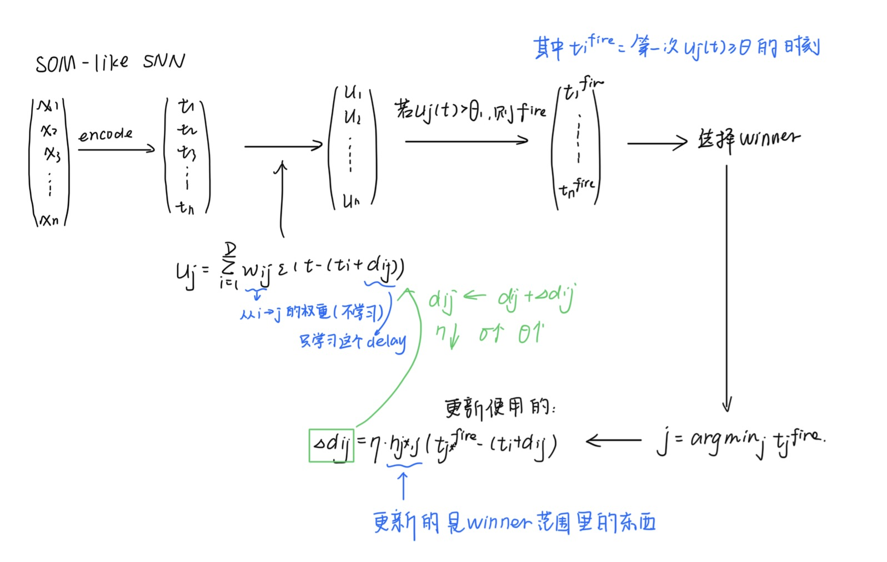
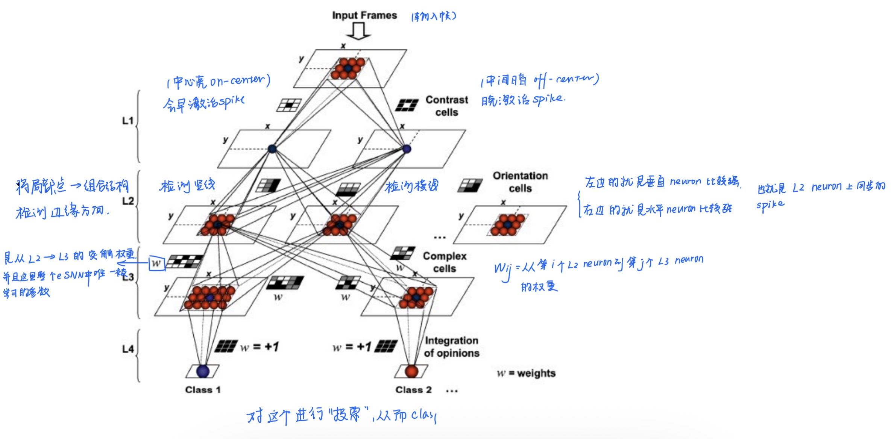
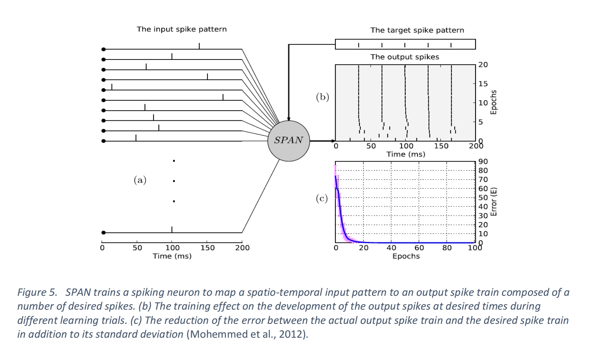

鏈墖璁烘枃鐨勫師鏂囧湴鍧€锛歔A review of learning in biologically plausible spiking neural networks](https://www.sciencedirect.com/science/article/abs/pii/S0893608019303181)銆?
    -  璁烘枃鍙戣〃鏃堕棿锛?020.2

# 0. introduction

- 鍓嶆儏鎻愯锛欰NN鐨勭伒鎰熸湰鏉ュ氨鏉ユ簮浜庣敓鐗╃绯荤粺锛屼絾鏄拰鐢熺墿楗跨缁忓厓鐩告瘮锛屼汉宸ョ缁忕綉缁滅殑鎶借薄绋嬪害楂橈紝涓旀棤娉曟崟鎹夌敓鐗╃缁忓厓澶嶆潅鐨勫姩鎬佹椂闂寸壒鎬э紝杩欎釜灏辨槸SNN鐨勮癁鐢熷鏈恒€?
- 鐢变簬SNN鑳藉鎹曟崏鐢熺墿瀛﹀師鐞嗙殑绁炵粡鍏冧赴瀵岀殑鍔ㄦ€佺壒寰侊紝骞朵笖琛ㄧず鎴愬拰鏃堕棿銆侀鐜囧拰鐩镐綅绛変笉鍚屼俊鎭淮搴︼紝鍥犳瀹冧滑鎻愪緵浜嗕竴绉嶉潪甯告湁鍓嶆櫙鐨勮绠楁ā寮忥紝骞朵笖鍙兘妯℃嫙鍒濆ぇ鑴戜腑澶嶆潅鐨勪俊鎭鐞嗚繃绋?
    - SNN杩樻湁澶勭悊娴烽噺鏁版嵁鍜屽埄鐢ㄨ剦鍐插簭鍒楄繘琛屼俊鎭〃绀虹殑娼滃姏

    - SNN涔熸槸鍩硅偛浣庡姛鑰楃‖浠?
- SNN涓殑鏃堕棿缂栫爜

    - 浼犵粺瑙傜偣璁や负鏄鐜囩紪鐮佲啋$Information鈭漟iring \text{ }聽rate$

    - 闂鍦ㄤ簬杩欏拰浜虹被澶ц剳澶勭悊淇℃伅鐨勯€熷害鏄敱寰堝ぇ涓嶅悓鐨?
        - 姣斿璇磋瑙夌缁忎腑$10灞傜缁忓厓\times 10ms鍙嶅簲鏃堕棿$$=100ms$

        - 濡傛灉浣跨敤棰戠巼缂栫爜灏辫缁熻涓€娈垫椂闂村唴鐨剆pike鏁伴噺锛岄渶瑕?00m鎴栨洿闀跨殑鏃堕棿鎵嶈兘缁熻棰戠巼锛屼粠鑰屽鑷存病鏈夎冻澶熸椂闂磋绠楅鐜?
    - 鎵€浠ュ彲浠ヤ娇鐢?\text{spike timing coding }$

        涓や釜绁炵粡鍏冿細

        ```C++
        Neuron A: spike at 10 ms
        Neuron B: spike at 12 ms
        ```

        杩欑 **鐩稿鏃堕棿宸?* 鏈韩灏辨惡甯︿俊鎭€?
        杩欑缂栫爜鏂瑰紡鍙細**Temporal coding锛堟椂闂寸紪鐮侊級**

        鎴栬€咃細**Time-to-first-spike coding**

    - 浣跨敤鏃堕棿缂栫爜鐨勪紭鍔?
        - 鏇村揩锛氬彧闇€瑕佷竴涓猻pike灏卞彲浠ヤ紶閫掍俊鎭?
        - 鏇寸渷鑳介噺锛氶鐜囩紪鐮侀渶瑕佸緢澶歴pike锛屼絾鏄椂闂寸紪鐮佸彧闇€瑕佸嚑涓猻pike灏卞彲浠ヤ簡

- 鏂扮殑鐮旂┒杩涘睍锛?
    - 鐢熺墿瀛﹀鍙戜俊澶氱褰㈠紡鐨勭敓鐗╃獊瑙︾殑鍙鎬р啋鏄敱绁炵粡鍏冨綋搴楄皟鎺х殑銆?
    - 杩欎釜鍜屼笉鍚屽舰寮忕殑绐佽Е鏉冮噸鍜屽欢杩熷涔犵殑SNN妯″瀷瀹炵浉绗︾殑


# 1. 鍥為【SNN瀛︿範绠楁硶鐨勭敓鐗╁鑳屾櫙

绁炵粡鍏冮€氳繃绐佽Е鐩镐簰杩炴帴锛屽舰鎴愬鏉傜殑缁撴瀯銆傛枃鐚患杩拌〃鏄庯紝璁捐鑴夊啿绁炵粡缃戠粶锛圫NN锛夊涔犵畻娉曟椂闇€瑕佽€冭檻鐨勯噸瑕佸洜绱犲寘鎷細绁炵粡鍏冩ā鍨嬨€佺獊瑙﹂€氫俊銆佺綉缁滄嫇鎵戠粨鏋勪互鍙婁俊鎭€?
## 1.1 SNN绁炵粡鍏冩ā鍨?
### 1.1.1 Hodgkin鈥揌uxley 妯″瀷锛?952锛?
鏈€鐪熷疄鐨勭敓鐗╁妯″瀷锛?*4缁村井鍒嗘柟绋嬨€?*鎻忚堪绂诲瓙閫氶亾鐢靛銆佽兘鐪熷疄澶嶇幇绁炵粡鐢电敓鐞嗚涓?
$C\frac{dV}{dt鈥媫=I鈭抔_{N_a}鈥媘^3h(V鈭扙_{N_a}鈥?鈭抔_K鈥媙^4(V鈭扙_K鈥?鈭抔_L鈥?V鈭扙_L鈥?$

- 浼樼偣灏辨槸鐢熺墿鐪熷疄鎬ч珮

- 缂虹偣灏辨槸璁＄畻閲忓ぇ

- 鎵€浠ヤ笉閫傚悎澶ц妯NN

鎵€浠ユ垜浠渶瑕佺殑鏄畝鍖栨ā鍨?


### 1.1.2 LIF锛圠eaky Integrate-and-Fire锛?
鏄父瑙佺殑SNN绁炵粡鍏?
妯″瀷锛?
$蟿_m\frac{dv_m(t)}{dt}鈥?鈭?v_m(t)鈭扙_r鈥?+R_mI(t)$

- $v_m(t)$锛氳啘鐢典綅

- $E_r$锛氶潤鎭數浣?
- $\tau_m$锛氳啘鏃堕棿甯告暟

- $R_m$锛氳啘鐢甸樆

- $I(t)$锛氳緭鍏ョ數娴?


#### **锛?锛夌洿瑙傜悊瑙ｏ細**

- **婕忕數锛?*

    - $鈭?v_m(t)鈭扙_r鈥?$

    - 鎰忔€濆氨鏄鏋滆啘鐢典綅楂樹簬闈欐伅鐢典綅锛岀數鍘嬪氨寰€鍥炴帀鈫掔被浼间簬婕忕數鐢靛$leaky$

- **杈撳叆鐢垫祦**锛?
    - $R_m鈥婭(t)$

    - 琛ㄧず锛氱獊瑙﹁緭鍏モ啋鐢垫祦鈫掓彁楂樿啘鐢典綅


#### 锛?锛夎緭鍏ョ數娴佺殑璁＄畻锛?
$I(t)=W鈰匰(t)$

鍏朵腑$W=[w_1鈥?w_2鈥?...,w_N鈥媇$琛ㄧず绐佽Е鏉冮噸銆?
鑰?S(t)=[s_1鈥?t),s_2鈥?t),...,s_N鈥?t)]$琛ㄧず杈撳叆spike淇″彿

鍚箟灏辨槸姣忎釜杈撳叆绁炵粡鍏冿細$spike\times weight$ 璐＄尞涓€涓數娴?


#### 锛?锛塻pike train 

$s_i鈥?t)=鈭慱f 鈥嬑?t鈭抰i^f鈥?$

- $ti^f鈥?锛氱f鍜宻pike鐨勬椂闂?
- $未$锛欴irac鍑芥暟

涓轰粈涔堣浣跨敤$未$? 鍥犱负spike瀹炲湪鏌愪釜绮惧噯浜嬩欢鍙戠敓鐨勭灛鏃舵椂闂?
```C++
鐢靛帇
  ^
  |      /\ 
  |     /  \ 
  |____/    \____
        t0
```

```C++
time 鈫?      |
      |
      |
```

鍙繚鐣欙細spike鍙戠敓鐨勬椂闂淬€傝繖灏辨槸 $未$ 鍑芥暟銆?


#### 锛?锛夌缁忓厓浣曟椂閲婃斁spike

褰撹啘鐢典綅杈惧埌闃堝€硷細

$v_m(t) \geq V_{th}$

绁炵粡鍏冧骇鐢燂細output spike锛涚劧鍚巖eset鍥炲埌$E_r$杩欎釜鐢典綅涓?
涔嬪悗鐭椂闂村唴涓嶈兘鍐嶅彂spike锛岃繖娈垫椂闂达細$t_{ref}$鍙仛**refractory period(涓嶅簲鏈?**


#### 锛?锛夋暣浣撴祦绋嬫€荤粨

```C++
杈撳叆spikes
     鈫?绐佽Е鏉冮噸鍔犳潈
     鈫?浜х敓鐢垫祦 I(t)
     鈫?鑶滅數浣嶅姩鎬佸彉鍖?     鈫?杈惧埌闃堝€?     鈫?浜х敓spike
     鈫?reset + refractory
```


杈撳叆鐢垫祦鐨勮绠楋細


褰擄細

$V>V_{threshold鈥媫$

鏃讹紝灏变細浜х敓spike锛岀劧鍚巖eset

- 浼樼偣鏄潪甯哥畝鍗曪紝璁＄畻蹇?
- 缂虹偣鏄敓鐗╃湡鏄€ц川杈冧綆


### 1.1.3 SRM锛圫pike Response Model锛?
杩欎釜涔熸槸涓€绉嶇畝鍖栨ā鍨?
鐗圭偣锛氱敤鏍稿嚱鏁拌棎瑙唖pike瀵硅啘鐢典綅鐨勫奖鍝?
---

## 1.2 绁炵粡鍏冨浣曞鐞嗚緭鍏pike

### 1.2.1 Intergrator锛堢Н鍒嗗瀷绁炵粡鍏冿級

鏈哄埗涓婂氨鏄細杈撳叆spike鈫掔疮鍔?
绁炵粡鍏冧細鍦ㄨ緝闀挎椂闂寸獥鍙ｅ唴杈撳叆锛?
$V(t)=鈭慞SP_i鈥?t)$

鍙瓒呰繃鎬诲拰闃堝€煎氨鍙互浜嗐€?
鐗圭偣锛?
- 鏃堕棿绐楀彛杈冮暱

- 瀵?spike 绮剧‘鏃堕棿涓嶆晱鎰?
鍚堥€傦細rate coding


### 1.2.2 Coincidence Detector(鍚屾妫€娴?

CD绁炵粡鍏冨彧瀵瑰悓鏃跺埌杈剧殑spike鏁忔劅銆?
濡傛灉涓や釜spike鏃堕棿宸緢灏忥細$螖t<系$ 灏变細鍑哄彂spike銆?
鐗圭偣锛?
- 瀵?**鏃堕棿闈炲父鏁忔劅**

- 閫傚悎 **temporal coding**


杩欎釜鍦ㄧ敓鐗╁涓浉鍏崇殑瀵瑰簲鍐呭灏辨槸鍚姏瀹氫綅绛夌瓑

---

## 1.3 SNN鐨勫涔犳満鍒垛€斺€旂獊瑙﹀彲濉戞€э紙Synaptic Plasticity锛?
### 1.3.1 浠€涔堟槸绐佽Е鍙鎬т笌瀛︿範鐨勫叧绯?
涔嬫墍浠ラ渶瑕佽繘琛岀獊绐佽Е鐨勬敼鍙橈細

**绐佽Е寮哄害锛坵eight锛変細鏍规嵁绁炵粡鍏冩椿鍔ㄥ彂鐢熸敼鍙?*

涔熷氨鏄

$w_{ij}鈥嬧啋w_{ij}鈥?螖w$

鎵€浠ユ垜浠湪杩欓噷鐨勫涔犲氨鏄敼鍙樿繛鎺ョ殑寮哄害


### 1.3.2 瀛︿範绉嶇被

|绫诲瀷|鍚箟||
|-|-|-|
|Unsupervised|鏃犳爣绛撅紝闈犲眬閮ㄨ鍒檤|
|Supervised|鏈夌洰鏍囦俊鍙穦|
|Reinforcement|濂栧姳椹卞姩||

閲嶇偣鍦ㄤ簬unsupervised


#### 1.3.2.1 Unsupervised learning

learning is based on local events

```SQL
姣忎釜绐佽Е鍙湅锛?- pre neuron 鏈夋病鏈夊彂 spike
- post neuron 鏈夋病鏈夊彂 spike
- 瀹冧滑鐨勬椂闂村叧绯?```

#### 锛?锛?鏃犵洃鐫ｅ涔犵殑鏈川鏈哄埗

鍙互鎶借薄鎴愶細

$螖w=f(\text{pre spike,post spike,t})$

杩欎篃灏辨槸锛氭潈閲嶅彉鍖?spike涔嬮棿鐨勫叧绯?
#### 锛?锛塇ebbian learning

鏍稿績鐨勭粡鍏歌鍒欏氨鏄細**Cells that fire together wire together**

涔熷氨鏄锛氬悓鏃舵縺娲烩啋杩炴帴澧炲己

鍗筹細A缁忓父瑙﹀彂鈫払涔熻窡鐫€瑙﹀彂

閭ｄ箞锛欰鈫払鐨勮繛鎺ュ彉寮?
#### 锛?锛塖TDP锛氭棤鐩戠潱瀛︿範鐨勫叿浣撳疄鐜?
- spike timing dependent plasicity锛氬熀浜庤剦鍐叉椂闂寸殑绐佽Е鍙鎬?
$t=t_{post}鈥嬧垝t_{pre}鈥?

鍗筹細鎸夌収鏃堕棿椤哄簭鏉ュ喅瀹氭槸澧炲己杩樻槸鍑忓急

**鎯呭喌1锛歱re鍦ㄥ墠锛堝洜鏋滐級**

- 瀛︿範瑙勫垯

$\text{濡傛灉t>0   (鍗硃re鍦ㄥ墠)}$

$螖w=A_+鈥媏^{鈭抰/蟿+}鈥?

鏉冮噸澧炲姞锛圠TP锛?
**鎯呭喌 2锛歱ost 鍦ㄥ墠锛堥潪鍥犳灉锛?*

- 瀛︿範瑙勫垯

$t<0$

$螖w=鈭扐_鈭掆€媏^{t/蟿鈭拀鈥?

鏉冮噸鍑忓皬

STDP鍏跺疄鏄湪瀛︿範锛氳皝鏇村儚鍘熷洜鈫掕皝灏变細琚姞寮?


#### 锛?锛夋€庝箞鍋氬埌classification

杈撳叆灏辨槸鏈変竴涓粨鏋滐紝鐒跺悗寮哄寲瀵硅嚜宸辨湁鍥犳灉鍏崇郴閭ｄ釜杈撳叆妯″紡

杩欐牱灏卞彲浠ヨ揪鍒颁竴涓缁忓厓=涓€涓ā寮忕殑鍏崇郴(杩欎釜涔熶笉涓€瀹氾紝鍙嶆鐩歌繎鐨勬ā寮忔湁鍙兘鍐呭垎鍒颁竴涓缁忓厓涓婇潰)

```SQL
杈撳叆 鈫?STDP 鈫?绁炵粡鍏冭嚜宸卞彉鎴?feature
```

涔熷氨鏄細STDP 閫氳繃鈥滆皝鍏堣Е鍙戣皝鈥濇潵寮哄寲杩炴帴锛屼娇涓嶅悓绁炵粡鍏冧笓闂ㄥ搷搴斾笉鍚岃緭鍏ユā寮忥紝浠庤€屽疄鐜扳€滆嚜鍔ㄥ垎绫烩€濄€?


#### 1.3.2.2 鐩戠潱瀛︿範锛圫upervised learning锛?
澶ц剳涓彲鑳芥湁鎸囧淇″彿锛屾潵鑷簬鎰熻鍙嶉鍜屽叾瀹冪缁忓厓缇?
灏忚剳鐨勭洃鐫ｅ涔犵殑閲嶈浣嶇疆锛屾槸澶ц剳鐨勨€滆宸煫姝ｇ郴缁熲€?
鏍稿績鏈哄埗锛氬己閾炬帴鈥斺€斿甫鍔ㄥ叾瀹冪殑杩炴帴瀛︿範

```SQL
A1 鈫?寰堝己锛堣€佸笀锛?A2 鈫?寰堝急锛堝鐢燂級
```

褰揂1瑙﹀彂B浜х敓spike锛孊琚€滆€佸笀鈥濆己琛屾縺娲?
鐒跺悗stdp鍙戠敓锛岀湅A2鐨勫墠鍚庡彂鐢熼『搴忥紝鍐冲畾婵€娲?or 鍓婂急

```SQL
杈撳叆 spike
     鈫?teacher neuron锛堟帶鍒惰緭鍑猴級
     鈫?post spike 琚浐瀹?     鈫?STDP 鏇存柊杩炴帴
     鈫?缃戠粶閫愭笎瀛︿細姝ｇ‘鏄犲皠
```


#### 1.3.2.3 寮哄寲瀛︿範Reinforcement learning

鍦⊿TDP涓婇潰鍙犲姞涓€灞傚鍔憋紝鐢ㄦ潵鏀惧ぇ鎴栨姂鍒禨TDP鐨勫涔犳柟鍚?
鏉冮噸鍙樻垚锛?螖w=STDP脳reward$


#### 1.3.2.4 寤惰繜瀛︿範Delay learning

鐩歌緝浜庝紶缁熺殑绁炵粡缃戠粶鍙涔?w$锛孲NN鍙互瀛?(w,d)$

杩欎釜delay learning鏄湪鏁欑郴缁熻嚜鍔ㄥ浼氬榻愭椂闂达紝浠庤€岃揪鍒?*coincidence detection**鐨勬潯浠?
鍙槸鐢⊿TDP鐨勭己鐐瑰氨鏄彧浼氬鎵惧崟涓殑寮虹壒鐐癸紝鑰屼笉鏄暣浣撶殑鐗圭偣


```SQL
spike timing
      鈫?coincidence detection
      鈫?STDP锛堝熀纭€瀛︿範锛?      鈫?+ teacher 鈫?supervised
+ reward  鈫?reinforcement
+ delay   鈫?timing alignment
```


### 1.3.3 淇℃伅缂栫爜锛坕nformation encoding锛?
绁炵粡鍏冧娇鐢╯pike浼犻€掍俊鎭紝浣嗘槸杩欎釜淇℃伅鍒板簳鍦ㄥ摢閲?
#### 锛?锛塺ate coding 

淇℃伅鏉ヨ嚜浜庡彂閫佷簡澶氬皯娆pike

$information鈭漟iring聽rate$

#### 锛?锛塼emporal coding

淇℃伅鏉ヨ嚜浜庡彂閫佺殑鏃堕棿

椤哄簭/鏃堕棿宸?鏈韩灏辨槸淇℃伅

鐗圭偣锛氶潪甯稿揩閫?淇℃伅瀵嗗害楂?鏇村姞鎺ヨ繎鐢熺墿澶ц剳

鑰屼笖鎴戜滑涓婇潰鎻愬埌鐨凷TDP銆乧oincidence decection銆乨elay learning闈炲父渚濊禆timing

temporal coding鐨勫嚑绉嶆柟寮忥細

- time-to-first-spike鈥斺€旇皝鍏堝彂锛屽氨浠ｈ〃淇℃伅閲嶈

- Rank-order coding锛圧OC锛夆€斺€旂湅绗嚑涓彂锛岃嚜瀹氫箟閭ｄ釜閲嶈銆備笉濂斤紒涓€鐐瑰櫔闊抽『搴忓氨鏀瑰彉

- Synchrony锛堝悓姝ョ紪鐮侊級鈥斺€斾竴璧峰彂锛屼唬琛ㄤ竴涓壒寰?
- Phase coding / latency coding鈥斺€旀湰璐ㄤ笂閮芥槸鏃堕棿宸紪鐮?
- Polychronization鈥斺€斾竴缁勭缁忓厓鍦ㄤ笉鍚屾椂闂寸簿鍑嗛厤鍚?


### 1.3.4 SNN鐨勬嫇鎵戠粨鏋?
鎷撴墤缁撴瀯绠€鍗曠悊瑙ｅ氨鏄細杩欎簺绁炵粡鍏冩槸鎬庝箞杩炴帴鍦ㄤ竴璧风殑

#### 1.3.4.1 涓夌鎷撴墤鐨勮繛鎺ョ粨鏋?
**锛?锛塮eed-forward**

杈撳叆鈫掍腑闂村眰鈫掕緭鍑?
**锛?锛塕ecurrent**

    A 鈫?B 鈫?C

    鈫?             鈫?

    鈫?鈫?鈫?鈫?
缃戠粶鏄湁璁板繂鐨勶紝杩囧幓鐨勭姸鎬佷細褰卞搷鐜板湪

**锛?锛塰ybrid**

娣峰悎鐘舵€侊紝鍥犱负涓嶅悓浠诲姟闇€瑕佷笉鍚岀殑鑳藉姏

- 鍓嶉 鈫?蹇€熷鐞?
- 寰幆 鈫?闀挎湡渚濊禆


#### 1.3.4.2 鐢熺墿澶ц剳鐨勭粨鏋?
澶ц剳涓嶆槸绠€鍗曠殑缃戠粶锛岃€屾槸clustered network锛堢皣缁撴瀯锛?
- 绨囩粨鏋勬槸鎸囩缁忓厓琚垎鎴愬緢澶氣€滃洟鈥?
- 姣忎釜鍥㈠唴閮ㄨ繛鎺ュ緢绱у瘑

- 涓嶅悓鍥㈢洿鎺ラ€氳繃鈥渉ub鈥濊繛鎺?
**scale-free network锛堟棤鏍囧害缃戠粶锛?*

鐗圭偣锛?
- 灏戞暟鑺傜偣杩炴帴寰堝锛坔ub锛?

- 澶氭暟鑺傜偣杩炴帴寰堝皯

灏卞拰浜掕仈缃戜竴鏍?
鐢熺墿鎰忎箟涓婂氨鏄珮鏁?绋冲畾+鎶楀共鎵?


鎷撴墤缁撴瀯鏄€滆繛鎺ユ柟寮忊€濓紝鑰?scale-free 鏄€滆繛鎺ユ暟閲忓垎甯冪殑瑙勫緥鈥濓紝涓よ€呮槸涓嶅悓灞傞潰鐨勬蹇碉紝浣嗗彲浠ュ悓鏃跺瓨鍦ㄣ€?


#### 1.3.4.3 鎷撴墤鐨勫彉鍖?
鍥犱负澶ц剳鐨勭壒鐐规槸锛氭牳蹇冨尯鍩熷緢绋冲畾锛岃竟缂樺尯鍩熺粡甯稿彉鍖?
鎵€浠NN涓篃鏈変竴绉嶆ā鍨嬪彨鍋氾細evolving SNN锛堟紨鍖栫綉缁滐級

**evolving SNN锛堟紨鍖栫綉缁滐級锛?*

- 杩欎釜妯″瀷涓嶄粎浠呭涔犵粡鍏哥殑鐨勬潈閲峸锛岃繕瀛︿範杩炴帴鍏崇郴锛岀敋鑷充細闀垮嚭鏂扮殑杩炴帴/鏃х殑杩炴帴鍒犻櫎


# 2. 瀛︿範绠楁硶鐨勯噸瑕佺粍鎴愰儴鍒?
## 2.1. Learning a single spike per neuron

### 锛?锛塻pikeprop

鏈夌偣绫讳技鐢变簬寮鸿灏咥NN鐨勮缁冩柟娉曟惉杩愬埌SNN涓婇潰锛屽尯鍒氨鏄湪SNN閲岄潰鐨剆pike鏄笉杩炵画鐨勶紝鎵€浠ユ搴︿笉濂界畻

浼氬嚭鐜板眬閮ㄦ渶浼樺拰鏈変簺绁炵粡鍏冧笉鍙戠殑鏁堟灉

#### **spikeprop涓嶤NN鐨勫尯鍒拰闂鍦ㄤ簬锛?*

- 绁炵粡鍏冭緭鍑虹殑鏄鏁ｆ椂闂达紝

- 杩欑鍙戞斁杩囩▼閫氬父鏄笉鍙鎴栬€呭緢闅炬眰瀵肩殑

|ANN|SpikeProp|
|-|-|
|杈撳嚭鏄暟鍊紎杈撳嚭鏄?spike 鏃堕棿|
|loss = 鏁板€艰宸畖loss = 鏃堕棿璇樊|
|鍙嶅悜浼犳挱|鍙嶅悜浼犳挱|


#### **SpikeProp鐨勮В鍐虫柟娉曪細**

- 涓嶈瀵硅剦鍐叉湰韬繘琛屾眰瀵?
- 鑰屾槸瀵硅剦鍐插彂鏀剧殑**鏃堕棿**杩涜姹傚

- 鐒跺悗鐢ㄨ繖涓繎浼兼搴﹀仛绫讳技鐨凚P璁粌

鎵€浠ヨSpikeProd灏辨槸鎶婂弽鍚戜紶鎾敼閫犲悗锛岀敤鍦ㄢ€樿剦鍐插彂鏀炬椂闂粹€欎笂鐨勬柟娉?


#### spikeprop鐨勫熀鏈唴瀹?
SpikeProp 鐨勭伒鎰熸潵婧愪簬缁忓吀鐨勫弽鍚戜紶鎾畻娉曘€係pikeProp 鏄竴绉嶅灞傝剦鍐茬缁忕綉缁滐紝宸叉垚鍔熷簲鐢ㄤ簬鍒嗙被闂銆傚湪璇ョ綉缁滀腑锛屼袱涓缁忓厓閫氳繃鍏锋湁涓嶅悓鏉冮噸鍜屽欢杩熺殑澶氭潯杩炴帴鐩镐簰杩炴帴(瑙佷笅鍥?銆?
![鍥綽涓紝鎴戜滑鍙互鐪嬪埌锛屼竴涓缁忓厓浜х敓鐨剆pike鍙互琚笉鍚岀殑绠￠亾锛屽洜涓轰笉鍚岀殑PSP锛屽啀鍒拌揪涓嬩竴涓缁忓厓銆傛渶鍚庤繖涓帴鍙楃殑绁炵粡鍏冪殑鏈€缁堣緭鍑哄氨鏄墍鏈塒SP鐨勬椂闂村彔鍔犵殑鏈€缁堢粨鏋淽(./transformer_attention/image 1.png)
鍥綽涓紝鎴戜滑鍙互鐪嬪埌锛屼竴涓缁忓厓浜х敓鐨剆pike鍙互琚笉鍚岀殑绠￠亾锛屽洜涓轰笉鍚岀殑PSP锛屽啀鍒拌揪涓嬩竴涓缁忓厓銆傛渶鍚庤繖涓帴鍙楃殑绁炵粡鍏冪殑鏈€缁堣緭鍑哄氨鏄墍鏈塒SP鐨勬椂闂村彔鍔犵殑鏈€缁堢粨鏋?


涓庡叾瀹冨熀浜庢搴︾殑鏂规硶绫讳技锛孲pikeProp 涔熷熀浜庤宸嚱鏁版搴︾殑浼拌锛屽洜姝ゅ瓨鍦ㄥ眬閮ㄦ渶灏忓€奸棶棰樸€傛澶栵紝闈欓粯绁炵粡鍏冩垨涓嶆縺娲荤缁忓厓鐨勫瓨鍦ㄤ篃浼氶樆纰嶆搴︾殑璁＄畻锛堣繖涓殑鎰忔€濆氨i鏄湁鏃跺€檚pike鏍规湰娌℃湁鍙戝嚭鐩稿叧鐨勪俊鍙凤紝鎴戜滑鐨勬搴﹂摼鏉″彲鑳戒細鏂帀銆傝繖涓缁冪洰鏍囦緷璧栦簬spike time锛屾病鏈塻pike time灏辨病鏈夋搴﹀叆鍙ｏ級銆?


#### spikeprop鐨勬敼杩?
- Back-propagation with momentum

- QuickProp

- RProp

- Levenberg鈥揗arquardt BP

- adaptive learning rate 鐨?SpikeProp 鍙樹綋

杩欎簺鏂规硶鏄湪鏀硅繘锛氭敹鏁涢€熷害銆佺ǔ瀹氭€с€佸涔犵巼銆佹搴︽洿鏂版晥鐜囥€佸灞€閮ㄦ瀬灏忓€肩殑椴佹鎬?


#### spikeprop鐨勬ā鍨嬪亣璁剧殑闄愬埗

妯″瀷鍋囪姣忎釜绁炵粡鍏冨彧鍙戜竴涓猻pike銆?
鍥犱负濡傛灉鍙戜簡寰堝鐨剆pike锛屾垜浠氨瑕佹壘spike鐨勫叧绯伙紝鍐嶈绠椾笂灏变細鍙樺緱闈炲父澶嶆潅

鎵€浠ュ彧鍙戜竴涓猻pike鎴戜滑灏卞彲浠ョ畝鍖栨垚锛?
$E=\frac{1}{2}鈥嬧垜_j鈥?t_j鈥嬧垝t_j^d鈥?^2$

- $t_j$锛氬疄闄呭彂鏀炬椂闂?
- $t_j^d$锛氭湡鏈涘彂鏀炬椂闂?
杩欐牱鎴戜滑鐨勫弽鍚戜紶鎾氨鏇村姞瀹规槗寤虹珛


spikeprop涓庣缁忓厓妯″瀷缁戝畾寰堟繁锛屾瘡娆℃崲涓€涓缁忓厓妯″瀷锛圫RM銆丩IF绛夛級瀵瑰簲鐨勮啘鐢典綅锛岄槇鍊肩瓑鎵€鏈夌殑褰㈠紡閮戒笉涓€鏍凤紝鎵€浠ヤ竴瀹氬彂鐢熸敼鍙?


鍥犱负杩欎釜灞€闄愭€э紝鏈変汉閲囩敤杩涘寲绛栫暐璁粌绐佽Е鏉冮噸鍜屽欢杩燂紝鍜宻pikeprop鐩告瘮锛岃鏂规硶鎬ц兘鑹ソ锛屼絾鏄缁冪畻娉曡€楁椂杈冮暱


### 锛?锛塖OM-like SNN(鑷粍缁囨槧灏?

鍩轰簬鑷粍缁囷紙Self-Organizing锛? Hebbian + delay 瀛︿範鐨?SNN 鑱氱被妯″瀷銆?
鏍稿績鎬濇兂鏄細涓嶅涔犫€滄潈閲嶁€濓紝鑰屾槸瀛︿範delay锛岃杈撳叆spike鍦ㄦ椂闂翠笂瀵归綈锛屼粠鑰岃Е鍙戞煇浜涚缁忓厓鈫掑疄鐜拌仛绫?


[璇︾粏鐨勬祦绋媇(./transformer_attention/%E8%AF%A6%E7%BB%86%E7%9A%84%E6%B5%81%E7%A8%8B+b95fe902-f39b-4216-845b-c505200e8257.md)

杩欐牱瀛愶紝閫氳繃寰幆锛岀浉浼艰緭鍏ヤ細鎶婂悓涓€鐗囧尯鍩熶竴璧峰褰紝鍥犳鏄犲皠鎴愮浉閭荤缁忓厓銆?


### 锛?锛?eSNN(evolving SNN)

缁撴瀯鏄細鍙樺寲鐨勶紝浣跨綉缁滀細鑷繁闀垮ぇ锛屾墍鐢ㄧ殑缂栫爜灏辨槸SOC锛屽苟鍙湅绗竴涓猻pike

闂鏄細蹇界暐浜嗗悗闈㈢殑spike锛屼涪鎺変簡temporal淇℃伅锛岃〃杈捐兘鍔涘急


eSNN鏄熀浜嶩ebbian learning鐨勶紝涔熷氨璇寸被浼间簬鈥滀竴璧锋椿鍔ㄧ殑绁炵粡鍏冿紝杩炴帴浼氬姞寮衡€濊繖绉嶆€濊矾锛涙瘮杈冮€傚悎online learning,涓嶉渶瑕佸儚鏅€氭繁搴︾綉缁滈偅鏍峰皢鏁翠釜鏁版嵁闆嗗弽澶嶈缁冨緢澶氳锛涘厛灏嗚緭鍏ュ厛缂栫爜鎴恠pike timing锛堣皝鍏堝彂spike锛岃皝鍚庡彂spike鐨勯『搴忔潵琛ㄧず淇℃伅锛?


evolving涓昏鏄寚锛氬綋鍏堣緭鍏ユ牱鏈埌鏉ョ殑鏃跺€欙紝缃戠粶涓嶄細鍙槸鎸夌収鍥哄畾鍙傛暟鍘昏绠椼€傜綉缁滀細鏍规嵁鏍锋湰鍐冲畾锛堣宸叉湁鐨勭缁忓厓浠ｈ〃杩欎釜妯″紡or鏂板缓涓€涓缁忓厓鏉ヨ〃绀轰竴涓柊鐨勮緭鍏ユā寮忥級锛屾墍浠ユ槸浼歟volving鐨勩€?
鎵硅瘎浜唀SNN鐨勯噸鐐癸紝鍙埄鐢ㄦ瘡涓緭鍏ョ獊瑙︿笂鐨刦irst spike锛屽悗闈㈢殑spike鍩烘湰蹇界暐銆?


L1锛歝ontrasr cells锛堝垵绾у姣旀娴嬶紝姣斿浜殫鍙樺寲銆佸眬閮ㄥ埡婵€锛?
L2锛歰rientation cells锛堣繖涓€灞傚儚鏄湪妫€娴嬫柟鍚戠壒寰侊紝姣斿妯嚎銆佺珫绾裤€佹枩绾匡級

L3锛歝omplex cells锛堜富瑕佺殑瀛︿範鍙戠敓鍦ㄨ繖閲岋級

L4锛欳lass锛堣繖涓€灞傛槸鍒嗙被杈撳嚭灞傦紝鎶?L3 鐨勭粨鏋滄暣鍚堣捣鏉ワ紝杈撳嚭绫诲埆 1銆佺被鍒?2 绛夛級

鍦↙3涓緭鍏ョ紪鐮佸拰瀛︿範涓昏渚濊禆浜巉irst spike / rank order锛屾墍浠ヨ繖涓槸eSNN鐨勪富瑕佺己闄?


### 锛?锛塪eSNN

鍦╡SNN鐨勫熀纭€涓婅繘琛屾敼鍙樸€?
鎴戜滑鍦ㄤ笂闈㈠彲浠ョ湅鍒帮紝鍘熷鐨別SNN鍙敤first spike锛屽拷鐣ュ悗缁殑spike锛屼粠鑰屽畠鐨勮〃杈捐兘鍔涙槸鏈夐檺鐨勶紝灏ゅ叾鏄紪闃熷鏉傜殑鑴夊啿寮忔ā寮?
#### Rank Order learing

浠荤劧淇濈暀Rank Order learing锛屼篃灏辨槸

$w_i^{init}鈥嬧垵rank(t_i^{first}鈥?$

璋佸厛spike鈫掑垵濮嬫潈閲嶅ぇ

璋佸悗spike鈫掑垵濮嬫潈閲嶅皬

杩欎竴閮ㄥ垎璐熻矗蹇€熷缓绔嬪垵濮嬫ā寮?
#### SDSP

鍔犲叆浜哠pike Driven Synaptic Plasticity锛屼篃灏辨槸deSNN鐨勫叧閿?
**瑙勫垯1锛氭敹鍒皊pike鈫掓潈閲嶅寮?*

$\text{if spike arrives}: w鈫?

**瑙勫垯2锛氭病鏈夋敹鍒皊pike鈫掓潈閲嶅噺寮?*

$\text{if no spike: w鈫搣$

鍥犱负杩欎釜浼氫緷璧栧悗闈㈢殑spike鐨勫彂鐢燂紝鎵€浠ュ緢濂界殑瑙勯伩浜唀SNN鐨勯棶棰?


鏁翠綋鐪嬫潵锛屽氨鏄垜浠厛鐢╮ank-first鐨勬柟寮忥紝寰楀埌涓€涓熀纭€鐨剋锛屼箣鍚庝娇鐢⊿DSP鐨勬柟寮忕户缁w杩涜寰皟


eSNN/deSNN鐨勭缁忓厓妯″瀷涓嶆槸鏍囧噯鐨勭敓鐗╂ā鍨嬶紝鑰屾槸鈥滃熀浜庨『搴忊€濈殑绠€鍖栨ā鍨嬨€?
瀹冨拰绁炵粡鍏冪殑鏍囧噯妯″瀷鐨勫尯鍒湪浜庯細

- 鍙叧绯籹pike鐨勫厛鍚庨『搴忥紝涓嶅叧蹇冪簿纭椂闂撮棿闅斻€佽繛缁椂闂村姩鍔涘

- no leakage in PSP

    - 姝ｅ父鐨凩IF妯″瀷鏄細$蟿\frac{du鈥媫{dt}=鈭抲+鈭慽nputs$

    - 杩欎釜閲岄潰鏈変釜-u鐨?*娉勯湶**


### 锛?锛塗empotron

鏄竴涓湁鐩戠潱瀛︿範鐨凷NN neuron锛岀敤浜庡仛浜屽垎绫?
鍋氬垎绫伙紙0/1锛?
鏍稿績瑙勫垯灏辨槸濡傛灉鍜岄鏈熶笉绗︼紝灏卞墛寮辨潈閲嶏紝鍙嶄箣澧炲姞

灞€闄愬湪浜庡彧鑳藉仛绠€鍗曞垎绫伙紝鎵╁睍鎬у樊

鏀硅繘锛?
Encoding鈫扵rempotron鈫抮eadout

鐗圭偣锛氫娇鐢ㄦ瘡涓猯atency coding锛屾瘡涓猲euron鍙彂涓€涓猻pike


###  鐜版湁鍗曡剦鍐叉柟娉曠殑鍏卞悓闂锛?
1. eSNN / deSNN
鈫?涓嶆槸鐪熸鐨勭敓鐗╁姩鍔涘妯″瀷锛堟棤 leakage锛?
2. Tempotron
鈫?鍙兘浜屽垎绫?
3. Yu 鏂规硶
鈫?浠嶇劧 single spike


## 2.2 Learning multiple spikes in a single neuron or a single layer of neurons

[鎬荤粨](./transformer_attention/%E6%80%BB%E7%BB%93+7f66d165-db44-43c7-9a7a-0df9f4371b31.md)

涓婇潰2.1涓彁鍒扮殑eSNN/deSNN,Tempotron,Yu绛夋柟娉曢兘鏈夊悇鑷殑缂虹偣锛屽洜涓鸿繖浜涙柟娉曟湁鍏卞悓鐨勫埗绾︼細杈撳嚭鏄痵ingle spike

鎵€浠ュ畠浠細琛ㄨ揪鑳藉姏鏈夐檺涓旀椂搴忎俊鎭埄鐢ㄧ殑涓嶅厖鍒?
澶氫釜spike鍙互寰堝ソ鐨勪赴瀵屼俊鎭紝浠庤€屽緱鍒版纭殑琛ㄨ揪淇℃伅鐨勬柟寮忋€?
multiple spikes 涓嶄粎琛ㄧず鈥滄湁娌℃湁鍙戞斁鈥濓紝杩樼紪鐮佷簡鈥滀粈涔堟椂鍊欏彂銆佸彂浜嗗嚑娆°€侀棿闅斿浣曗€濓紝鍥犳鏃堕棿缁撴瀯鏈韩鎴愪负鍙敤淇℃伅銆?
杩欎釜涔熸湁鐢熺墿璇佹嵁鏀寔鈥斺€旀枒椹奔锛岀簿鍑唖pike timing鎺у埗鍔ㄤ綔鈫掍篃灏辨槸璇村簭鍒楁湰韬氨鏄俊鎭€?
鎵€浠ユ垜浠渶瑕佹壘鍒颁竴涓neuron鍙憁ultiple spikes鐨勫涔犳柟娉曘€?
### 锛?锛塻upervised hebbian

鐢ㄧ洃鐫ｇ増鐨凥ebbian 锛堢被STDP锛夊彲浠ュ鏃堕棿妯″紡锛屼絾鏄湁缂洪櫡

浣嗘槸鏈変袱涓棶棰橈細

1. 涓嶄繚璇佹敹鏁涳紙璁粌鍙兘涓嶇ǔ瀹氾紝浼氬彂鏁r闇囪崱锛?
2. 鍗充娇宸茬粡姝ｇ‘浜嗕絾鏄繕鍦ㄤ慨鏀规潈閲嶏紙宸茬粡瀛﹀浜嗭紝浣嗘槸杩樺湪鏇存柊锛?
妯″瀷涓嶇ǔ瀹氾紝瀹规槗鐮村潖宸插鐨勭煡璇?
### 锛?锛塻tatistical methods锛堢粺璁℃柟娉曪級

鐢ㄦ鐜囨柟娉曪細$maxP(鍦ㄧ洰鏍囨椂闂村彂spike)$

缂虹偣锛?
1. 闅句互瀛︿範澶嶆潅鐨?spike train

2. 娌℃湁瀹為檯鐨勫簲鐢?
### 锛?锛塕eSuMe

鏄竴绉嶇洃鐫ｅ涔犵畻娉曪紝鍙互璁粌绁炵粡鍏冧骇鐢熲€滄寚瀹氱殑澶歴pike杈撳嚭搴忓垪鈥?
鐩爣锛?杈撳叆\text{spike pattern}鈫掓湡鏈涚殑杈撳嚭\text{spike train}$

#### 鏈哄埗锛?
1. 鍩轰簬STDP+anti-STDP

    - STDP锛氬寮烘纭殑鏃跺簭

    - anti-STDP锛氭姂鍒堕敊璇殑鏃跺簭

1. 寮曞叆teacher spike train锛堟牳蹇冿級

    - 鏈変竴涓€佸笀淇″彿锛氱洰鏍囪緭鍑烘椂闂村簭鍒?
    - 妯″瀷鍋氭硶锛氬鏋滃綋鍓嶈緭鍑衡墵teacher鈫掕皟鏁存潈閲?
1. 鏈川涓婃槸涓€涓猈idrow-Hoff

    $w鈫恮+畏(target鈭抩utput)$

    鍙槸鎹簡spike褰㈠紡

#### 瑙ｅ喅闂锛?
1. 鑳界敓鎴恗ultiple spikes鈥斺€斾笉鍐嶆槸single spike

2. 閬垮厤浜唖ilent neuron鐨勯棶棰樷€斺€斿洜涓虹幇鍦ㄦ湁浜唗eacher鐨勪俊鍙封啋鎵€浠ュ己鍒舵縺娲?
3. 淇濈暀浜嗙敓鐗╁悎鐞嗘€р€斺€斿簭鍒楁€ц川鐨則

4. 鏀寔online learning

浣嗘槸ReSuMe渚濇棫鏄紶缁熺殑绁炵粡缃戠粶鐨勮寖寮忥紙璋冩潈閲嶏級


#### 浠诲姟褰㈠紡锛?
鏂囦腑鍐欑殑鏄細

$S(t)=[s_1(t),s_2(t),...s_N(t)]$

杩欒〃绀鸿緭鍏ユ椂N涓緭鍏ョ獊瑙︿笂鐨剆pike train銆?
#### 鍚勪釜绗﹀彿锛?
- $s_i(t)$锛氱i涓緭鍏ョ獊瑙︿笂鐨勮剦鍐插簭鍒楋紝鍗虫煇涓緭鍏ラ€氶亾鍦ㄦ椂闂磋酱涓婄殑鍙戞斁鎯呭喌

- $s_d(t)$锛歞esired output spike train

    - 涔熷氨鏄痶eacher甯屾湜绁炵粡鍏冭緭鍑虹殑鐩爣搴忓垪

- $s_o(t)$锛歛ctual output spike train

    - 杩欎釜灏辨槸璁╁綋鍓嶇殑绁炵粡鍏冪湡瀹炲彂鍑烘潵鐨剆pike搴忓垪锛岃缁冪洰鐨勬槸锛?s_o(t)\approx s_d(t)$

#### 瀹冪殑鏍稿績瀛︿範鍏紡

$\frac{d蠅_i(t)}{dt} = [s_d(t)-s_o(t)][a+\int_{0}^{+鈭炩€媫T_W(s)s_i(t-s)ds]$

- 澶栧眰$s_d(t)-s_o(t)$琛ㄧず褰撳墠鏃跺埢t锛屽埌搴曞簲璇ラ紦鍔卞寮猴紝杩樻槸榧撳姳鍑忔潈

- 鍐呭眰$a+\int_{0}^{+鈭炩€媫T_W(s)s_i(t-s)ds$琛ㄧず绗琲涓緭鍏ョ獊瑙︼紝瀵瑰綋鍓嶆椂鍒荤殑瀛︿範鏇存柊搴旇璐＄尞澶氬皯

    - $a$锛氳繖涓殑浣滅敤鏄仛涓€涓暣浣撳亸宸淇椤?
        - 濡傛灉瀹為檯杈撳嚭spike鏁伴噺姣旂洰鏍囧锛岄偅涔堣繖涓」鍊惧悜浜庢暣浣撳噺鏉?
        - 濡傛灉瀹為檯杈撳嚭spike鏁伴噺姣旂洰鏍囧锛岄偅涔堣繖涓」鍊惧悜浜庢暣浣撳鏉?
        - 濡傛灉娌℃湁杩欎釜椤圭殑璇濓紝鍗曢潬灞€閮⊿TDP鍨嬬殑鏇存柊锛屾湁鏃跺€欏涔犱細姣旇緝婊★紝鍥犱负鎴戝敞宓嬩綘鍙湁鍦ㄥ叿浣撴煇涓緭鍏pike鍜屾煇涓緭鍑簊pike鍋氶厤瀵?
        - 鑰宎鎻愪緵浜嗕竴涓洿鍔犲叏灞€鐨勪慨姝ｏ紝璁╄缁冩洿蹇?
    - $\int_{0}^{+鈭炩€媫T_W(s)s_i(t-s)ds$

        - 杩欎釜鏄渶鏍稿績鐨勨€滄椂搴忕浉鍏崇殑閮ㄥ垎鈥?
        - 瀹冭〃绀猴細鍦ㄥ綋鍓嶆椂鍒?t 涔嬪墠锛岀 $i$ 涓緭鍏ョ獊瑙︽湁娌℃湁鍦ㄤ笉涔呭墠鍙戣繃 spike锛涘鏋滃彂杩囷紝鑰屼笖瓒婃帴杩戝綋鍓嶆椂鍒伙紝璐＄尞瓒婂ぇ銆?
        $T_W(s) = 
\begin{cases} 
Ae^{-s/\tau}, & s \ge 0 \\ 
0, & s < 0 (\text{杩欎釜鍥犳灉绐楀彛锛屽拰鏈潵鏃犲叧})
\end{cases}$

        - 杩欎竴娈佃鏄庯細杩欐槸涓€涓寚鏁拌“鍑忕獥鍙ｏ紝璺濈浣嗘蹇垫椂鍒昏秺杩戠殑鍘嗗彶杈撳叆spike锛屽奖鍝嶈秺澶э紱瓒婃棭浠ュ墠鐨剆pike锛屽奖鍝嶈秺灏忋€?
            - A锛氬箙鍊硷紝鎺у埗鏇存柊寮哄害銆?
            - $蟿$锛氭椂闂村父鏁帮紝鎺у埗鈥滃洖鐪嬪杩溾€濓紝瓒婂ぇ鐪嬬殑灏辫秺涔?


#### 鎵ц閫昏緫

**锛?锛夊綋鐩爣spike鍒版潵鏃?*

鍋囪鐩爣甯屾湜鍦ㄦ椂鍒?t_d$鍙戦€乻pike

閭ｄ箞锛?s_d(t_d)=1$

濡傛灉杩欎釜鏃跺€欑缁忓厓杩樻病鏈夊彂鍑哄搴旂殑杈撳嚭锛屽氨浼氬€惧悜浜庡寮洪偅浜涘湪 $t_d$鈥?鍓嶄笉涔呭彂杩?spike 鐨勮緭鍏ョ獊瑙︺€?
鍥犱负杩欎簺闈犺繎鐨勮緭鍏ユ渶鏈夊彲鑳芥槸鈥滃府鍔╃缁忓厓鍦?t_d$鍙戞斁鈥濈殑鍥犳灉璇佹嵁閾?
**锛?锛夊綋瀹為檯杈撳嚭spike鍒版潵鏃?*

鍋囪绁炵粡鍏冨湪$t_o$鍙戜簡涓€涓笉璇ヤ笌鐨剆pike

閭ｄ箞$s_o(t_o)=1锛宻_d(t_o)=0$锛岃繖涓椂鍊欏氨浼氬€惧悜浜庯細鍑忓急鍝簺鍦?t_o$鍓嶄笉涔呭彂杩噑pike鐨勮緭鍏ユ彁鍑恒€?
鍥犱负杩欎簺杈撳叆鏈€鏈夊彲鑳?瀵艰嚧浜嗚繖涓敊璇殑杈撳嚭"

**锛?锛夊弽澶嶈缁冨悗鐨勭粨鏋?*

缁忚繃涓嶆柇鐨勯噸澶嶅氨鍙互鍋氬埌锛?
- 璇ュ湪鐩爣鏃跺埢鍓嶈捣浣滅敤鐨勮緭鍏ヨ繛鎺ヤ細琚寮?
- 瀵艰嚧閿欒鍙戞斁鐨勮緭鍏ヨ繛鎺ヤ細琚墛寮?


#### 涓轰粈涔堝畠鍙互瀛﹀埆浜轰笉浼氱殑multiple spike?

鍥犱负瀹冨涔犵殑鏄?s_d(t)-s_o(t)$锛屽湪鏁存潯鏃堕棿杞翠笂鐨勮宸湪瀛︿範锛屾墍浠ュ彧瑕佺洰鏍囬噷闈㈡湁澶氫釜spike锛?t_1,t_2,t_3$锛屽氨浼氬垎鍒湪杩欎簺鏃跺埢闄勮繎澧炲己/閿叆鐩稿叧杩炴帴灏变細琚鍔?鎯╃綒


#### ReSuMe鐨勪紭缂虹偣锛?
1. 鑳藉鐩爣spike train鈥斺€斿涔犵殑鏃跺簭鐨勮緭鍑?
2. 鏄洃鐫ｅ涔犫€斺€旂洰鏍囨槑纭?
3. 鏈変竴瀹氱敓鐗╁悎鐞嗘€?
4. 鑳藉湪绾垮涔?
#### ReSuMe鐨勫眬闄?
1. 浠荤劧鏄熀浜庢潈閲嶈皟鏁粹€斺€斾紶缁熺殑蠅鐨勮皟鏁磋寖寮?
2. 鏃跺簭鎺у埗鍙兘姣旇緝鏁忔劅

3. 澶氱缁忓厓銆佸灞傛墿灞曞苟涓嶅ぉ鐒剁畝鍗?


||ReSuMe|eSNN / deSNN|
|-|-|-|
|杈撳叆|spike trains|spike trains|
|杈撳嚭|spike train锛堟椂闂村簭鍒楋級|绫诲埆|
|瀛︿範鐩爣|瀵归綈鏃堕棿搴忓垪|鍒嗙被|
|鏄惁鍏虫敞绮剧‘鏃堕棿|鉁?闈炲父閲嶈|鉂?涓昏鐪嬮『搴弢
|杈撳嚭褰㈠紡|澶?spike|鍗?spike / 鎶曠エ|
|鏈川浠诲姟|temporal regression|classification|


### 锛?锛塖PAN

鍥犱负ReSuMe鏈変竴涓殣鍚殑闂锛歴pike train寰堥毦浼樺寲锛堜笉杩炵画銆佷笉鍙井銆佸緢闅剧敤鏍囧噯鏁板宸ュ叿锛夛紝鎵€浠PAN鐨勬€濊矾灏辨槸灏嗗叾鍙樻垚杩炵画鐨?
杩欎釜鍜孯eSuMe寰堢浉浼硷紝鍩烘湰涓婂氨鏄湪ReSuMe鐨勫熀纭€涓婂仛鐨勶紝鍖哄埆鍦ㄤ簬锛?
ReSuMe锛氱洿鎺ュ湪 spike 涓婂仛瀛︿範锛堜簨浠堕┍鍔級
SPAN锛氬厛鎶?spike train 鍙樻垚杩炵画淇″彿锛屽啀鐢ㄢ€滄櫘閫氭暟瀛︽柟娉曗€濆幓瀛?
SPAN灏嗛毦澶勭悊鐨剆pike train鍙樻垚濂藉鐞嗙殑杩炵画鍑芥暟

#### step1锛氬厛灏唖pike train杞崲鎴愯繛缁俊鍙凤細

- 灏嗗師濮嬬殑$s(t)鈫抶(t)$锛岀劧鍚庨€氳繃鍗风Н锛?x(t)=危_k魏(t-t_k)$

- 杩欐牱灏卞彲浠ュ皢姣忎釜 spike 鍙樻垚涓€涓皬鍑歌捣锛屼粠鑰屽彔鍔犳垚杩炵画鐨勬洸绾?
#### step2锛氳緭鍏ヨ緭鍑洪兘鍙樻垚杩炵画淇″彿

- 杈撳叆锛?s_i鈥?t)鈫抶_i鈥?t)$

- 杈撳嚭锛?s_o鈥?t)鈫抷(t)$

- 鐩爣锛?s_d鈥?t)鈫抷_d鈥?t)$

鐜板湪鐨勯棶棰樺氨鍙樻垚浜嗭細$y(t)鈮坹_d(t)$

杩欐牱灏卞彉鎴愪簡**鍑芥暟鎷熷悎鐨勯棶棰?*

#### step3锛氱敤Widrow-Hoff(螖 rule)瀛︿範

绫讳技浜庯細

$螖w_i鈥嬧垵鈭?y_d鈥?t)鈭抷(t))x_i鈥?t)dt$

涔熷氨鏄?*璇樊$\times$杈撳叆淇″彿**

#### step4锛氬啀杞細spike


#### SPAN鐨勪紭鐐癸細

- 鍙互鐢ㄦ爣鍑嗙殑鏁板宸ュ叿

- 鏇寸ǔ瀹氾細涓嶆兂STDP浼氬眬閮ㄩ渿鑽?
- 鍙互澶勭悊澶嶆潅鐨剆pike train 鍥犱负鏄竴涓暣浣撴倝灏煎彿

#### SPAN鐨勯檺鍒?
- 鍥犱负鍘熷鐨勭増鏈彧鏄缁冨崟涓猲euron锛屽悗鏉?013骞存墠鎵╁睍锛屽垎绫讳换鍔′粛閫€鍖栦负single spike鐨勯棶棰?


- 宸﹁竟锛氭瘡涓€琛岃〃绀轰竴涓猲euron锛屽皬绔栫嚎琛ㄧず璇euron鍦ㄦ煇涓椂闂村彂spike

    - 杩欐暣涓乏杈圭浉褰撲簬$\{s_1(t),s_2(t),...s_N(t)\}$

- 涓棿杩涜

    - step1锛歴pike鈫掕繛缁俊鍙?
    $s_i鈥?t)鈫抶_i鈥?t)$

    - step2锛氱嚎鎬х粍鍚?
    $y(t)=鈭慱iw_i鈥媥_i鈥?t)$

    - step3锛氬尮閰嶇洰鏍囦俊鍙?
    $y(t)鈮坹_d(t)$

- 鍙充笂瑙掔粨鏋滐細灏辨槸鏄剧ず闅忕潃epoches鐨勫鍔犺緭鍑洪€愭笎瀵归綈鐨勮繃绋?
- 鍙充笅瑙掑氨鏄樉绀烘垜浠殑error瓒婃潵瓒婂皬


### 锛?锛塁hronotron version1 E-learnig

- ReSuMe锛氬眬閮ㄨ鍒欙紝涓嶆槸涓ユ牸浼樺寲

- SPAN锛氳浆杩炵画锛屼絾娌℃湁涓ユ牸瀵归綈 spike 鏃堕棿

- SpikeProp锛氭搴﹂毦鐢紙涓嶈繛缁級

Chronotron鍜孯eSuMe鐨勫尯鍒湪浜嶳eSuMe鏄竴涓潬缁忛獙閫艰繎鐨勶紝浣嗘槸杩欎釜鏂规硶鏄湁涓€涓槑纭殑loss function锛屽畾涔変簡$\text{E(output聽spike聽train,target聽spike聽train)}$

鎵€浠ヨ繖涓柟娉曠殑鐩爣鏄仛绮惧噯鏃堕棿瀵归綈鐨勪紭鍖栧涔?
#### **step1锛氱敤鏍稿嚱鏁拌〃绀虹缁忓厓鐨勫搷搴?*

浣跨敤SRM+kernel function;

鍥犱负姣忎釜杈撳叆鐨剆pike閮戒細浜х敓涓€涓狿SP锛?魏(t鈭抰_i鈥?$

鐒跺悗灏嗘墍鏈夌殑杈撳嚭鍙犲姞锛?
$u(t)=鈭戔€媉iw_i鈥嬧垜_k鈥嬑?t鈭抰_i^k鈥?$

灏唖pike鍙樻垚杩炵画淇″彿锛岀幇鍦ㄧ殑绁炵粡鍏冪姸鎬佹椂杩炵画鍑芥暟$u(t)$

#### **step 2锛氬畾涔?normalized PSP锛埼伙級**

$位_j鈥?t)$锛氳繖涓椂鍘绘帀鏉冮噸涔嬪悗鐨凱SP锛堝彧鏈夋椂搴忥級

浣滅敤锛?
- 鍒嗙鈥滆緭鍏ユ椂搴忕粨鏋勨€濆拰鈥滄潈閲嶁€?
- 渚夸簬鍒嗘瀽鍜屼紭鍖?
#### **step 3锛氬畾涔夎宸嚱鏁?*

杩欓噷鑰冭檻浜嗕笁绉嶉敊璇細

1. 灏戜簡spike锛坕nsertion error锛?
2. 澶氫簡spike锛坉eletion error锛?
3. 鏃堕棿涓嶅锛坰hift error锛?
鏉冮噸鏇存柊鏄細

$螖w_j鈥?鈭抃frac{鈭侲鈥媫{鈭倃_j}$

鏈川涓婂氨鏄搴︿笅闄嶃€備絾鏄搴︽椂杩戜技鐨勪絾涓嶆槸涓ユ牸瑙ｆ瀽鐨?


Chronotron涓嶆槸鍦ㄥ仛鍙堟病鏈塻pike锛岃€屾槸鎶妔pike浠庨敊璇殑鏃堕棿绉诲姩鍒版纭殑鏃堕棿涓婇潰


**鍥伴毦鍦ㄥ摢**

spike涓嶆槸杩炵画浜嬩欢$\text{spike聽=聽threshold聽crossing}$

dynamics寰堝鏉傦細鎵€绉峴pike绔欎箣闂寸浉浜掑奖鍝嶃€佹椂闂翠緷璧栧己


### 锛?锛塁hronotron I-learning

鐢≧eSuMe鐨勫眬閮ㄨ鍒欐潵杩戜技瀹炵幇Chronotron version 2

1. 鍩烘湰鎬濇兂锛氬鏋滃湪鐩爣鏃堕棿閲岄潰鍙戜簡spike锛氬氨浼氭湁$\omega$涓婂崌锛涗絾鏄鏋滄湁涓嶅簲璇ュ彂鐨勶紝灏变細鎶戝埗

2. ReSuMe鐨勫尯鍒細ReSuMe浣跨敤鐨勬槸$e^{鈭抰/蟿}$

3. I-learning鐢ㄧ殑鏄細涓や釜鎸囨暟涔嬪樊锛?魏(t)=e^{鈭抰/蟿_1}鈥嬧垝e^{鈭抰/蟿_2}$锛屼篃灏辨槸鎴戜滑璇寸殑alpha function

    4. $蟿_1$锛氭帶鍒朵笂鍗囬€熷害

    5. $蟿_2$锛氭帶鍒惰“鍑忛€熷害

6. 浣跨敤鍙屾暣鏁扮殑鍘熷洜锛氬畠鏄厛涓婂崌鈫掔劧鍚庡啀涓嬮檷鐨勶紝鏈夊嘲鍊煎拰鏃堕棿閫夋嫨鎬э紝鍙屾寚鏁板彲浠ユ洿鍔犵簿鍑嗙殑鍒荤敾鈥滀粈涔堟椂鍊欐洿閲嶈鈥濃€?
7. 杩樻湁涓€涓娉ㄦ剰鐨勫尯鍒槸ReSuMe鏈変竴涓?a(鍏ㄥ眬鍙橀噺)$,浣嗘槸I-learning閲岄潰娌℃湁杩欎竴椤癸紱杩欎篃鎰忓懗鐫€鏇存帴杩戜弗鏍间紭鍖栵紝浣嗘槸鍙兘浼氭敹鏁涢€熷害鎱竴鐐?
8. 杩欎釜鏂规硶閫傚悎**鍗曠缁忓厓绾у埆鐨勭簿纭椂搴忓涔犳柟娉?*


### 锛?锛塖WAT

SWAT = STDP锛堟椂搴忥級 + BCM锛堝彂鏀剧巼锛?鈫?鐢ㄥ彂鏀剧巼鏉ョǔ瀹?STDP 鐨勫涔狅紝浣嗗彧鑳藉鐞?rate coding锛屼笉鏄湡姝ｇ殑鏃堕棿缂栫爜鏂规硶


STDP锛堝熀鏈殑$\text{pre聽before聽post鈬抴鈫憓$    $\text{pre after post}鈬抴鈫?锛?
BCM 鏉冮噸鏇存柊鍙栧喅浜?*post-synaptic raie锛堟柟娉曠巼锛?*

BCM涓嶇洿鎺ユ洿鏂版潈閲嶏紝鑰屾槸锛氳皟鑺係TDP鐨勨€滃涔犵獥鍙ｅ己搴︹€?
鍗?螖w鈭漒text{BCM聽factor}脳\text{STDP聽update}$


BCM鏄敤鏉ョǔ瀹氬涔犺繃绋嬶紝浠庤€岄槻姝DTP鏈韩瀹规槗鍙戞暎銆佷笉绋冲畾鐨勯棶棰?
鍩烘湰娴佺▼锛?
$\text{spike timing} 鈫? $\text{rate 鈫抐ilter}锛堟槸涓€涓殣钘忓眰锛屽杈撳叆鐨勫彂鏀剧巼鍋氭护娉?鐗瑰緛鎻愬彇锛?

鈫?鍒嗙被$


**缂虹偣锛?*

缂虹偣灏辨潵婧愪簬杩欎釜rate coding锛?
鍥犱负SWAT涓嶅缓妯℃椂闂寸粨鏋勶紝鍙崟绾繚鐣檚pike per unit time銆傛墍浠ワ細SWAT 鍙互鍖哄垎涓嶅悓 firing rate锛堜緥濡?100Hz vs 1000Hz锛夛紝浣嗘棤娉曞尯鍒嗗叿鏈夌浉鍚屾垨鐩歌繎骞冲潎鍙戞斁鐜囥€佷絾鏃堕棿缁撴瀯涓嶅悓鐨?spike patterns銆?


### 锛?锛塂L-ReSuMe锛圖elay Learning ReSuMe锛?
DL-ReSuMe = ReSuMe锛堣皟鏉冮噸锛?+ 瀛︿範绐佽Е寤惰繜锛堣皟鏃堕棿锛夛紝浠庤€屾洿濂藉湴瀵归綈杈撳嚭 spike 鐨勬椂闂?
#### 鍔ㄦ満锛歊eSuMe鐨勯棶棰?
ReSuMe鍙兘閫氳繃璋冩暣鏉冮噸鈫掗棿鎺ュ奖鍝峴pike鐨勬椂闂淬€?
浣嗘槸鏉冮噸鍙兘鎺у埗寮?寮猴紝涓嶈兘鐩存帴鎺у埗鈥滄椂闂村榻愨€濄€傜粨鏋滃氨鏄鏋渟pike鐨勬椂闂翠笉瀵癸紝鍙兘閫氳繃鏉冮噸鍘婚殧闈存悢鐥掞紝鎱笖涓嶇簿鍑?


#### 鏍稿績鎬濇兂锛氬紩鍏?d_i鈥?\text{synaptic聽delay}$

鐜板湪灏嗘瘡涓緭鍏ュ彉鎴?s_i鈥?t鈭抎_i鈥?$锛岃繖绉嶈緭鍏ヤ俊鍙锋槸鍙互閫氳繃鏃堕棿骞崇Щ鏉ヨ繘琛屾椂闂翠笂鐨勫榻?
鎵€鏈夌殑妯″瀷閮藉彉鎴愶細$杈撳嚭鏃堕棿=f(w_i鈥?d_i鈥?$

- $w_i$鈥嬶細寮哄害

- $d_i鈥?锛氭椂闂翠綅缃?


#### 鎬庝箞鍋氾紵

**Step1锛氬儚ReSuMe涓€鏍疯皟鏁存潈閲?*

- teacher spike

- STDP / anti-STDP

**Step 2锛氳皟鏁?delay**

- 澶棭鈫抎elay澧炲ぇ锛堟帹杩燂級

- 澶櫄鈫抎elay鍑忓皬锛堟彁鍓嶏級


#### 缁撴灉涓婄殑浼樺娍

- 鏇撮珮鐨勭簿搴︼紙10% higher accuracy锛?
- 鏇村揩鐨勬敹鏁涳紙鈥渕uch faster learning speed鈥濓級

- 鑳藉澶勭悊浣庨/鐭簭鍒楃殑闂锛坰horter duration and smaller mean frequency锛?
- 瑙ｅ喅silent window problem锛堝彲浠ュ皢鍏跺畠鏃堕棿鐨剆pike璋冭繃鏉ワ級


#### 闂锛?
- delay 鍙皟鐢ㄤ竴娆★紙鍚庨潰鏉冮噸鍙兘鏀瑰彉浜嗭級

- 澶歴pike鐨勬儏鍐靛彲鑳戒細寰堝鏉傦紙涓嶅悓鐩爣spike浼氬啿绐侊級


#### 瑙ｅ喅鏂规锛欵DL锛坋xtended锛?
- 鍏佽澶氳瘝璋冩暣delay+weight

    - 鍗?(w,d)閮芥槸鍔ㄦ€佹洿鏂扮殑$


### 锛?锛塋SM

杩欎釜鍜屽墠闈㈢殑鍐呭鏈夊緢澶х殑鍖哄埆鈫掍笉璁粌缃戠粶鏈韩锛岃€屾槸灏嗗畠褰撴垚"鍔ㄦ€佺壒寰佹彁鍙栧櫒"

LSM = 涓€涓浐瀹氱殑閫掑綊 SNN锛坮eservoir锛?+ 涓€涓彲璁粌鐨勮鍑哄眰锛岀敤鏉ユ妸鏃堕棿搴忓垪鏄犲皠鎴愬垎绫荤粨鏋?
#### LSM鐨勬暣浣撶粨鏋?
$\text{Input spikes鈫扲eservoir (LSM)鈫扲eadout}$

- Reservoir锛氫竴涓殢鏈鸿繛鎺ョ殑閫掑綊SNN

    - 鏈塮eedback锛屾湁鍔ㄦ€侊紝浣嗘槸涓嶈缁冩潈閲?
- readout layer

    - 涓€涓畝鍗曠殑妯″瀷锛氱嚎鎬у垎绫诲櫒銆丼VM銆乀empotron銆乄idrow-Hoff

    - 浣滅敤鏄粠reservoir鐨勭姸鎬侀噷闈㈣鍑虹粨鏋?


#### LSM鍦ㄥ仛浠€涔?
- **杈撳叆锛?\text{spike train}$**

- **涓棿锛?鍔ㄦ€佺郴缁燂紙鏈夎蹇嗭級$**

- reservoir 浼氫骇鐢燂細

$x(t)=f(褰撳墠杈撳叆 + 杩囧幓杈撳叆)$

- **杈撳嚭锛?*class label


#### 鍘熺悊锛?
鍥犱负$x(t)$涓嶄粎渚濊禆褰撳墠杈撳叆锛岃繕渚濊禆杩囧幓杈撳叆


#### 涓€涓瘮鍠伙細

LSM锛氬線姘撮噷涓㈢煶澶粹啋娉㈢汗鎵╂暎

杈撳叆spike锛氱被浼间簬鎵板姩

reservoir锛氭妸鎵板姩鍙樻垚澶嶆潅鍔ㄦ€?
readout锛氱湅褰撳墠鈥滄按鐨勫舰鐘垛€濆垽鏂緭鍏?


#### 浼樺娍锛?
- 璁粌绠€鍗?
- 寰堝己鐨勬椂闂村缓妯¤兘鍔涳紙recurrent聽dynamics锛氳嚜鍔ㄥ氨鏈夎蹇嗙瓑锛?
- 娉涚敤鎬у己锛堣闊宠瘑鍒€佹満鍣ㄤ汉鎺у埗銆丒EG锛?


#### 闄愬埗锛?
- reservoir 涓嶈缁?
- 涓嶅彲瑙ｉ噴鎬у己

- 鎬ц兘涓嶄竴瀹氭槸鏈€浼樼殑锛堟病鏈変紭鍖杛eservoir鐨勭粨鏋勶級


#### 鐩稿叧鏀硅繘锛?
鍥犱负LSM鏄竴涓鏋讹紝涓嶆槸涓€涓浐瀹氱殑妯″瀷锛屾墍浠ラ兘鏄彲浠ユ敼鍙樼殑 


### 锛?0锛塸olychronous groups+LSM

**浠€涔堟槸polychronous group?**

- 涓嶅悓鏃堕棿鍙戞斁锛屼絾鏄湁鍥哄畾鐨勬椂闂村叧绯伙紙灏辨槸鐩稿綋浜庤櫧鐒跺紑濮嬬殑鏃堕棿涓嶇‘瀹氾紝浣嗘槸姣忎釜涔嬮棿涓棿鐨勯棿闅旀槸纭畾鐨勶級鈫掓湰璐ㄤ笂灏辨槸涓€涓椂闂寸粨鏋刾attern

**鎬庝箞鍋氬垎绫伙紵**

鎴戜滑鍋囪涓嶅悓绫诲埆鈫掓縺娲讳笉鍚岀殑polychronousgroup

**濡備綍璁粌**锛?
鍙皟鏁磖eadout neuron鐨刣elay锛屼簤鍙栬姝ｇ‘鐨勭被鍒洿鏃╃殑spike

**浼樺寲鐩爣**锛?t_{wrong}鈥嬧垝t_{correct}鈥嬧啈$

**闄愬埗**锛?
- 涓€涓猺eadout 浜х敓涓€涓猻pike

- 鏉冮噸涓嶆洿鏂?
- 鎬ц兘涓嶅浼犵粺鏂规硶


### 鏁翠綋闂锛?
铏界劧瀛︿範浜唌ultiple spikes锛屼絾鏄繖绉嶆柟娉曞彧鑳藉湪鈥滃崟灞傜缁忓厓or鍗曞眰鈥濅笂宸ヤ綔锛屽緢闅炬墿灞曞埌澶嶆潅缃戠粶

- 涓€鏃﹀眰鏁版墿灞曪紝spike鏁伴噺涓婃定锛?O(\text{spikes} \times \text{neurons})$

- 灞傛暟涓婂崌涔嬪悗锛屼笂涓€灞傝緭鍑簊pike train锛屼笅涓€灞傚氨瑕佸涔犲畠锛岃繖鏍疯宸殑浼犻€掓椂閫愭笎绉疮鐨?
- credit assignment problem锛氬嵆鍝釜neuron璇ヤ负鏌愪釜spike璐熻矗锛屽湪multi-kayer+multi-spike涓婃槸瀹屽叏娣蜂贡鐨?


## 2.3 Learning multiple spikes in a multilayer spiking neural network

### 1. 澶氬眰缁撴瀯浜庡鑴夊啿缂栫爜鐨勫繀瑕佹€?
杩欎釜灏辨槸缁忓吀绁炵粡缃戠粶鐞嗚鎵€鎻愬嚭鐨勶紝鍗曞眰perceptron鍙兘鍋氱嚎鎬у彲鍒?澶氬眰鐨勫垯鍙互鍋氶潪绾挎€х殑

杩欐潯缁撹鍦⊿NN閲岄潰涔熼€傜敤銆傜敱Sporea et al.璇佹槑multilayer SNN 鍙互瀹炵幇 XOR锛岃€屽崟灞傜殑涓嶈銆?
鍓嶉潰2.1鍜?.2鐨勫唴瀹规湰璐ㄤ笂鏄笉瓒冲鐨勶紝鍥犱负鏃犳硶瀹炵幇澶嶆潅鐨勯潪绾挎€т换鍔?
鍦ㄥ彧鏈変竴灞傜殑spike閲岄潰锛岃〃杈剧殑鐡堕鏄粨鏋勬繁搴?鐨勯棶棰橈紝2.2涓璵ultiple spikes鎻愬崌鐨勬槸鏃堕棿琛ㄨ揪鑳藉姏銆傝€宮ultilayer鎻愬崌鐨勬槸锛氬嚱鏁板鏉傚害

|妯″瀷|鏃堕棿琛ㄨ揪鑳藉姏|闈炵嚎鎬ц〃杈捐兘鍔泑XOR鑳藉姏|鏃堕棿妯″紡璇嗗埆|灞傜骇鐗瑰緛|鎺ヨ繎鐢熺墿绁炵粡|
|-|-|-|-|-|-|-|
|鍗曞眰 + single spike|脳|脳|脳|脳|脳|脳|
|鍗曞眰 + multiple spikes|**鈭?*|脳|脳|**鈭?*|脳|閮ㄥ垎|
|澶氬眰 + single spike|脳|**鈭?*|**鈭?*|脳|**鈭?*|閮ㄥ垎|
|澶氬眰 + multiple spikes|鈭殀鈭殀鈭殀鈭殀鈭殀鈭殀

|鑳藉姏绫诲瀷|鏉ユ簮|浣滅敤|
|-|-|-|
|temporal锛堟椂闂磋兘鍔涳級|multiple spikes|琛ㄨ揪鏃堕棿缁撴瀯锛堥棿闅斻€侀鐜囥€乸attern锛墊
|structural锛堢粨鏋勮兘鍔涳級|multilayer|琛ㄨ揪澶嶆潅鍑芥暟锛堥潪绾挎€с€佸眰绾х壒寰侊級|


### 2. 鐜版湁鐮旂┒鐨勬紨杩涘拰灞€闄愭€?
#### 锛?锛塖TDP multilayer

**a. Bichler et al., 2012**

杩欎釜瀛︿範淇″彿鐨勬柟娉曞彧鏄壘鍒扳€滆皝鍜岃皝缁忓父涓€璧峰嚭鐜扳€濓紝瀹屽叏娌℃湁鐢ㄥ埌label/error.task objective绛?
鎬庝箞鍋氱殑锛?
- 涓ゅ眰SNN(input鈫抙idden)

    - 鐒跺悗鍚巋idden neuron鈫掑彂spike

    - 鍏朵腑姣忓眰SNN鐨勬洿鏂版潈閲嶇殑鏂规硶灏辨槸STDP

- 浣跨敤LIF neuron

- 杈撳叆鏃禔ER瑙嗚浜嬩欢鏁版嵁


瀛︿範鏂瑰紡锛?
- 浣跨敤local STDP

- 灞炰簬unsupeervied learning

鐗瑰緛瀛︿範鐩爣锛?
- 鎻愬彇锛歵emporally overlapping features

    - 缁忓父涓€璧峰嚭鐜扮殑spike鈫掓潈閲嶅ぇ

- 浠庢椂闂翠笂閲嶅彔鐨剆pike pattern 涓彁鍙栫壒寰?
闂灏辨槸锛?
- 闂1锛歋TDP澶矖绯欎簡锛屽洜涓轰娇鐢ㄧ殑LTD鏄亽瀹氱殑锛岃€屼笉鏄牴鎹椂闂村樊鍙樺寲

- 闂2锛氭病鏈変换鍔＄洰鏍囷紝杩欎釜鏂规硶鍙槸鍙戠幇pattern锛屼絾鏄笉鐭ラ亾杩欎釜pattern瀵瑰垎绫绘槸鍚︽湁鐢ㄣ€傛墍浠ヨ杩欎釜鍙槸feature extractor锛岃€屼笉鏄痩earning system

- 闂3锛氭病鏈塷utput鐨勫紩瀵笺€俬idden layer瀹屽叏涓嶇煡鍒扮┒绔熻鍋氫粈涔堜换鍔°€傛墍浠ュ彲鑳芥病鏈夊鍒版湁鐢ㄧ殑pattern


**b. Wang et al., 2014(online learning algorithm for SNN)**

**1.杈撳叆灞傦細鎶婂疄鏁板彉鎴恠pike锛堢紪鐮侊級**

杈撳叆鏃讹細real-valued data

澶勭悊鏂瑰紡灏辨槸锛歱opulation coding 鈫?spike timing

鍗筹細

- 涓€涓暟鍊尖啋鐢ㄥ涓猲euron琛ㄧず

- 鏁板€煎ぇ灏忊啋鐢╯pike鐨勨€滃彂鏀炬椂闂粹€濊〃绀?
**2.hidden灞傦細鐢╟lustering瀛︾粨鏋?*

鐗圭偣鏄粨鏋勫紡鍔ㄦ€佸彉鍖栫殑锛岄€氳繃鑱氱被绠楁硶杩涜鍒嗙被锛岀被浼间簬unsupervised feature grouping

**3.output灞傦細鐢⊿TDP鍋氬垎绫?*

STDP+anti-STDP

**4.缂栫爜鏂瑰紡锛?*

杈撳叆灞傦細latency coding鈫掔敤璋佸厛鍙憇pike琛ㄧず淇℃伅

hidden灞傦細time to first spike鈫掔敤绗竴涓猻pike鐨勬椂闂?
output灞傦細rate coding鈫掕皝鍙戠殑spike澶氣啋灞炰簬鍝釜绫诲埆

**5.鍒嗙被鏈哄埗**锛?
鍝釜output neuron鍙戠殑spike澶氣啋灞炰簬鍝釜绫诲埆


**鎵硅瘎锛?*

- **闂1锛氬悇灞傛槸鈥滃垎寮€璁粌鈥濈殑**

    - hidden 鍦ㄥ仛clustering

    - output 鍦ㄥ仛STDP

    - 涓よ€呮病鏈夎仈绯伙紝瀵艰嚧layer interaction寰堝樊锛宧idden瀛︾殑涓滆タ,output涓嶄竴瀹氳兘鐢ㄤ笂

- **闂2锛氬眰闂村崗鍚屽け璐?*

    - 鍚勫眰閮藉湪鑷繁鍋氳嚜宸辩殑锛屾病鏈夌粺涓€浼樺寲鐩爣

- **闂3锛氱紪鐮佹柟寮忎笉涓€鏍?*

    - 渚濇棫鍜屼笂闈竴鏍凤紝灏辨槸涓夊眰涓嶇粺涓€鐨勯棶棰?
- **闂4锛氬姩鎬佺粨鏋勪笉鍚堢悊**

    - 鍥犱负娌℃湁鐢熺墿鏈哄埗璇佹槑杩欎釜鍔ㄦ€佹灦鏋勬槸鍚堢悊鐨?


鍥犱负涓婇潰鐨勯兘鏄棤鐩戠潱鐨勶紝灏嗚繖涓崲鎴愭湁鐩戠潱鐨勶紝鎵€浠ユ湁浜哄皾璇曠敤ANN锛宔rror+backword鐨勬柟娉?


#### 锛?锛塆radient methods

杩欎釜灏辨槸鍊熼壌浜咥NN鐨勭粡鍏告柟娉曘€?
Gradient methods 灏辨槸鐢ㄨ宸嚱鏁?姊害涓嬮檷鐨勬柟娉曟潵璁粌SNN

鍙槸鎶夾NN绉嶇殑鏁板€艰緭鍑哄彉鎴愪簡spike time

鍏朵腑缁忓吀鐨勬斁灏辨槸SpikeProp,SpikeProp灏辨槸鐢ㄦ搴︽妸error浠巓utput浼犲洖hidden

浣嗘槸杩欎釜鏂规硶鍙兘瀛︿範single spike


#### 锛?锛塜u 2013

杩欎釜灏辨槸鍦ㄤ笂闈㈢殑鍩虹涓婂皢single spike杞寲鎴恗ultiple spikes

Xu et al. (2013) 灞炰簬鍩轰簬姊害鐨勫涔犳柟娉曪紝鍏朵富瑕佽础鐚湪浜庡皢璇樊鍙嶅悜浼犳挱鎵╁睍鍒板 spike 鎯呭喌锛屼娇澶氬眰 SNN 鑳藉瀛︿範鐩爣 spike train銆?
Xu 2013鍋氬埌浜唌ultilayer/multiple spikes/supervised

杩欎釜鏄竴涓噷绋嬬寮忕殑鏂规硶


**鏍稿績鏈哄埗锛?*

1. **error function**

$E = 0.5 * 危_j 危_f (t_P{actual}(j,f) - t_{target}(j,f))虏$

姣忎釜spike瀵归綈鈫掔畻鏃堕棿宸啋姹傚拰

1. **涓€涓叧閿殑鍋囪**

杩欎釜鏂规硶鍋囪actual spike 鏁?= target spike 鏁?
1. **濡傛灉涓嶇浉绛夛紵**

鍙栬緝灏戠殑閭ｄ釜$n_l$鈫掑彧姣旇緝鍓嶉潰$n_l$涓猻pike

1. **瀛︿範瑙勫垯锛?*

瀵筫rror姹傚锛屽緱鍒版洿鏂板叕寮忋€?
1. **骞叉壈闂锛?*

鍥犱负鎵€鏈夌殑鏉冮噸閮界敱鍚屼竴缁勬潈閲嶄骇鐢燂紝鍗充竴涓潈閲嶅悓鏃跺奖鍝嶅緢澶歵锛屽彲鑳藉涓潈閲嶇殑鍚屾椂鏀瑰彉涓€涓猻pike鐨勬搴︼紝鏈€缁堝鑷寸浉浜掓姷娑?or 涓嶇ǔ瀹?
浣跨敤BPBA鍘熷垯锛欱igger PSP 鈫?Bigger Adjustment

鐩稿綋浜庡彧璁╃湡姝ｅ鑷磗pike鐨勮緭鍏ヤ富瀵艰繖娆＄殑鏇存柊

鎬庝箞鍋氱殑锛?
杩滅spike鐨勮緭鍏モ啋PSP=0鈫掑嚑涔庝笉鏇存柊

鎺ヨ繎spike鐨勮緭鍏モ啋PSP澶р啋鐤忓鏇存柊


1. 宸﹁竟鏄痠nputs锛堣緭鍏ュ眰锛夛紝涓棿鏄痟idden layer锛堥殣钘忓眰锛夛紝鍙宠竟鏄痮utputs锛堣緭鍑哄眰锛夈€?
    杩欎釜鍜屾櫘閫氱殑浼犵粺绁炵粡缃戠粶鐨勫敮涓€鍖哄埆鏄細姣忎釜绁炵粡鍏冭緭鍑虹殑涓嶆槸涓€涓暟锛岃€屾槸涓€杩炰覆鐨剆pike鏃堕棿銆?
    浼犵粺 NN锛? y_j = 鏁板€?

    SNN锛?    $y_j = \{t鈧? t鈧? t鈧? ...\}$

1. 鍙宠竟鏄瀛愰摼鎺?
    涓や釜绁炵粡鍏冧箣闂翠笉鏄竴鏉¤竟锛岃€屾槸澶氭潯銆?
    姣忎釜杩炴帴閮芥湁涓€涓潈閲嶏紝涓€涓猟elay

    $u_j鈥?t)=鈭慱i鈥嬧垜_k鈥媤_{ij}^{(k)}鈥嬑?t鈭抰_i鈥嬧垝d_{ij}^{(k)}鈥?$

    - 鐩磋鐨勭悊瑙ｏ細

        - 瀵逛簬涓€涓緭鍏pike锛岄€氳繃涓嶅悓鐨刣elay鍙樻垚$t_i+d_1$銆?t_i+d_2$銆?...

        - 灏辨槸灏嗕竴涓猻pike灞曞紑鎴愪负澶氫釜鏃堕棿鐗堟湰

        - 杩欎釜鏄负浜嗭細鏋勯€犱竴涓叧浜巘鐨勫嚱鏁帮紝鐢ㄤ竴缁刡ase function鏉ラ€艰繎鐩爣鍑芥暟

1. 鏍稿績鏈哄埗

    杈撳叆锛氬涓猻pike delay涔嬪悗鐨勭粨鏋?
    PSP绱锛氭瘡涓猻pike浜х敓涓€涓狿SP锛?蔚(t - t_i - d)$銆傜劧鍚庡姞璧锋潵寰楀埌$u(t)$

    杩欏紶鍥炬樉绀虹殑灏辨槸PSP鐨勬洸绾垮彔鍔狅紝褰?u(t)鈮theta$鏃讹紝浼氫骇鐢熶竴涓猻pike


**鏍稿績闂涓庢壒璇勶細**

1. 鐩存帴鍒犻櫎浜嗗悗闈笉鍖归厤鐨剆pike锛屽己鍒跺榻?
2. 澶氫釜spike浼氱浉浜掑共鎵?
3. BPBA绫讳技浜嶴TDP锛堟湁鐢熺墿鎰忎箟锛夆啋浣嗘槸娌℃湁鍒嗘瀽鍏跺畠椤圭殑浣滅敤

4. 鍜孯eSuMe鐩告瘮锛孯eSuMe鍦ㄧ煭鏃堕棿閲岄潰鏇村ソ锛孹u 2013涓嶄竴瀹氭槸鏈€浼樼殑


#### 锛?锛夊熀浜庢搴︾殑SNN瀛︿範鏂规硶鎵€闈复鐨勫眬闄愭€?
鍩轰簬姊害鐨凷NN瀛︿範鏂规硶瀛樺湪鏍规湰鎬х殑鍥伴毦锛屽挨鍏跺啀璁粌澶歴pike杈撳嚭鐨勬椂鍊欙紝杩欎簺闂浼氭斁澶с€?
**鍩轰簬姊害鐨勫涔犳柟娉曟湰韬氨涓嶇ǔ瀹氾細**

1. 鍦ㄨ缁冪殑杩囩▼绉?loss鍙兘绐佺劧澶у箙涓婂崌锛岃€屼笉鏄钩婊戜笅闄?
2. 杩欐槸鍥犱负绁炵粡鍏冪殑鑶滅數浣嶅叿鏈変袱涓€ц川锛氶潪绾挎€?闈炲崟璋?
3. 杩欎釜灏卞鑷村皬鐨勬潈閲嶅彉鍖栵紝鍙兘浼氬鑷磗pike浼氬彂鐢熺獊鍙樷啋瀵艰嚧spike鏃堕棿绐佺劧澶у箙搴﹀彉鍖?
**multiple spike浼氳闂鏇村姞涓ラ噸锛?*

1. 姣忎釜绁炵粡鍏冭鍙戝涓猻pike锛屾瘡涓猻pike閮芥槸涓€涓猼hreshold crossing锛岃繖鏍风郴缁熺殑澶嶆潅搴﹀氨浼氬ぇ搴︿笂鍗囷紝杩欐牱璁粌浼氭洿涓嶇ǔ瀹?
2. error寰堥毦瀹氫箟锛屽洜涓哄疄闄呰緭鍑虹殑spike鏁伴噺鈮犵洰鏍噑pike鏁伴噺銆備細鐔埗鏃犳硶鐩存帴涓€涓€瀵瑰簲銆俵oss function寰堥毦璁捐

3. 浣嗘槸闂鍦ㄤ簬澶氫釜spike鍙互缂栫爜鏇村鐨勪俊鎭紝鎵€浠ヨ繖涓槸蹇呴』鐨?


姣旇緝浜嗚繖涔堝鐨刧radient鏂规硶涔嬪悗锛屼綔鑰呭緱鍑虹粨璁猴細鍩轰簬灞€閮ㄨ鍒欑殑 STDP 鍙兘鏇撮€傚悎鐢ㄤ簬澶氬眰 SNN 鐨勫涔?


### 3. 杞悜STDP鐨勫眬閮ㄥ涔?
鏍规嵁涓婇潰鐨勫垎鏋愶紝鎴戜滑鎯宠鐭ラ亾鏈夋病鏈変笉鐢╣radient锛岃€屼娇鐢⊿TDP鍋氬灞傜洃鐫ｅ涔犵殑鏂规硶

鎬讳綋鎬濇兂鏄娇鐢⊿TDP鍜宎nti-STDP鍋氫竴涓被浼肩洃鐫ｅ涔犵殑瑙勫垯锛屽簲鐢ㄤ簬澶氬眰SNN (input/hidden/output閮藉彲浠ュ彂multiple spikes)

#### 锛?锛夊父瑙凷TDP鐨勯棶棰樺拰鏀硅繘鏂规硶

- 闂1锛氶殣钘忓眰娌℃湁鐪熸鍙備笌瀛︿範

    - 鍗虫病鏈変娇鐢╤idden neuron鑷繁鐨勮緭鍑簊pike

    - STDP鏈潵鏄?螖w 鈭?\text{pre spike + post spike}$

    - 杩欓噷鍙樻垚鍙湅杈撳叆锛屼笉鐪媓idden杈撳嚭

    - 杩欎釜浼氬鑷村涔犱俊鍙蜂笉瀹屾暣/涓嶇鍚堢敓鐗╂満鍒?涔熶笉鍒╀簬涓庡涔犳晥鏋?
- 闂2锛歨idden layer鐨剆pike寰堥噸瑕?
    - 杩欎釜灏辩浉褰撲簬鏍规湰娌℃湁鐪熸璁粌澶氬眰缃戠粶

- 鏀硅繘鏂瑰悜1锛氬皢hidden neuron鐨勮緭鍑簊pike绾冲叆瀛︿範瑙勫垯

    - 涔熷氨鏄彉鎴愮湡姝ｇ殑pre+post

- 闂3锛氬叴濂?鎶戝埗绁炵粡鍏冩病鏈夊尯鍒?
    - 鏃犺鏄疨SP姝?璐燂紝閮界敤鍚屼竴涓洿鏂拌鍒欌啋杩欏湪鐢熺墿瀛︿笂涓嶅悎鐞?
- 鏀硅繘鏂瑰悜2锛氭牴鎹甈SP绫诲瀷璁捐涓嶅悓鐨勫涔犺鍒?
    - excitatory锛堟璐＄尞锛?
    - inhibitory锛堣礋璐＄尞锛?
    - 鏉ヨ璁′笉鍚岀殑瀛︿範瑙勫垯

    - 鏇寸鍚堢敓鐗╂満鍒?鎻愬崌鎬ц兘

#### 锛?锛夊鍓嶉潰STDP鐨勬敼杩涚増 

Taherkhani 2018

杩欎釜鏂规硶浠荤劧鏄洃鐫ｅ涔狅紝鍒伴偅鏃跺己璋冪敓鐗╁悎鐞嗘€?浣跨敤multiple spike timing

- **鏍稿績鏈哄埗锛?*

    **浣跨敤multiple spike timing**

    - 鐢╯pike鐨勭簿鍑嗘椂闂存潵缂栫爜淇℃伅锛屼粛鐒舵槸temporal coding锛堜笉鏄痳ate锛?
    **hidden+output灞傚悓鏃跺涔?*

    - 闅愯棌灞傚拰杈撳嚭灞傚悓鏃舵洿鏂?
    **浣跨敤 STDP + anti-STDP + delay learning**


- **鏀硅繘鐐?锛氫娇鐢╤idden neuron 鐨剆pike**

    - hidden neuron 鐨勮緭鍑?spike 琚敤鏉ユ洿鏂版潈閲?
- **鏀硅繘鐐?锛氬尯鍒唀xcitatory / inhibitory**

- **鏀硅繘鐐?锛歞elay learning** 

    - 鍏跺疄鍜屼笂闈竴鏍凤紝灏辨槸闇€瑕佷竴涓猟elay鍊?


### 4. 鎬荤粨浜庡垎绫?


澶у鏁版柟娉曢兘鍑犵鍦ㄥ崟涓猻pike鎴栧崟绁炵粡鍏?鍗曞眰锛屽洜涓鸿繖绉嶆柟娉曟瘮杈冪畝鍗?


#### rate coding vs. temporal coding

- rate coding 

    - 涓嶅叧蹇僺pike鏃堕棿锛屽彧鐪嬫暟閲?
    - 淇℃伅 = 鍙戞斁棰戠巼

- temporal coding 

    - 淇℃伅鍦ㄢ€滅簿纭椂闂粹€濋噷

    - 淇℃伅 = spike timing


**single spike O(1) vs. multiple spike O(n)**

- **single spike**

    - spike prop鏄吀鍨嬩唬琛?
    - 铏界劧鍙互鍋氬灞傦紝鍙兘single spike

    - 绠€鍗曚絾鏄苟涓嶇湡瀹?
- **multiple spike**

    - 浼樼偣鍦ㄤ簬鏇寸鍚堢敓鐗?淇℃伅閲忔洿澶?
    - 浣嗘槸闂鍦ㄤ簬鏇撮毦璁粌


## 2.4 Learning algorithms with delay leaning ability

鏈変袱绉嶅涔燿elay鐨勬柟娉?
### 锛?锛塂elay Selection锛堝欢杩熼€夋嫨锛?
**鏍稿績鎬濇兂**锛氫笉鍘诲涔燿elay锛岃€屾槸棰勫厛缁欏緢澶歞elay锛岃妯″瀷鑷繁閫?
**鍏蜂綋鍋氭硶**锛?
- 涓や釜绁炵粡鍏冧箣闂?
    - 涓€涓繛鎺モ啋鍙樻垚澶氫釜sub-connections

    - 姣忎釜瀛愯繛鎺ユ湁涓嶅悓delay锛?d_1, d_2, d_3, ..., d_k$

    - 鐒跺悗璁粌鐨勬椂鍊欙細濂界殑delay鈫掓潈閲嶅彉澶э紱涓嶉€傚悎鐨刣elay鈫掑湀瀛愪腑鍙樺皬

    - 杩欐牱澶氫釜delay鍙互鍙犲姞鍑哄鏉傜殑temporal pattern锛?
    $u(t)=\sum\limits_a \omega_i \cdot \epsilon (t - t_i - d_i)$

    - 涓嶅悓鐨?d_i$浼氳PSP鍦ㄤ笉鍚屾椂闂村彔鍔犫啋褰㈡垚澶氫釜宄板€尖啋澶氫釜spike

**缂虹偣锛?*

- 鍙傛暟鏁伴噺鈫戯紙姣忎釜杩炴帴鍙樺涓級

- 璁＄畻鎴愭湰鈫?


### 锛?锛塪elay shift锛堝欢杩熺Щ鍔級

**鏍稿績鎬濇兂**锛氱洿鎺ユ妸delay褰撲綔鍙涔犵殑鍙傛暟

**缁忓吀妯″瀷**锛欳D锛圕oincidence Detector锛夛紝浣滅敤鏄彧鏈夊涓猻pike鏃堕棿瀵归綈鎵嶈Е鍙?
鍗宠皟鏁磀elay锛屼簤鍙栧仛鍒?t_i鈥?d_i鈥嬧増t_j鈥?d_j鈥?


DL-ReSuMe銆丒DL銆乀aherkhani 2018 multilayer SNN銆傝繖浜涢兘鏄痙alay shift鎬濊矾鐨勬墿灞曠増鏈?


## 2.5 Deep Spiking Neural Networks锛堟繁搴﹁剦鍐茬缁忕綉缁滐級

杩欎竴鏁存灏卞湪璇达細SNN鏄浣曡蛋鍚戔€滄繁搴﹀涔犵殑鈥?
灏嗘繁搴﹀涔犵殑鏂规硶璁鸿縼绉诲埌SNN涓婏紝浣嗗彂鐜板洶闅惧緢澶р啋浜庢槸褰㈡垚浜嗗嚑鏉′笉鍚岀殑鍙婃妧鏈矾绾?


**DNN锛?*

- Deep Neural Network

    - 姣忓眰缁撴瀯锛坙ayer by layer锛?
    - 姣忎竴灞傞兘鍦ㄥ鐞嗘柊鏁版嵁

- 姣忎竴灞傚仛涓嶅悓鐨勪簨鎯咃細

    - 鎻愬彇鐨勭壒寰佽秺鏉ヨ秺鎶借薄

    - 琛ㄧず鐨勪篃瓒婃潵瓒婇珮绾?
        - 鍍忕礌 鈫?杈圭紭 鈫?褰㈢姸 鈫?鐗╀綋

- representation 

    - raw input 鈫?representation 鈫?classification

杩欎釜灏辨槸涓€涓仛濂芥繁搴︽ā鍨嬬殑缁忓吀绛旀銆傛爣鍑嗗氨鏄繖鏍风殑

SNN鍋氱殑濂斤紝涔熻灏介噺瀛︿範杩欐牱鐨勭粨鏋?


### 2.5.1 Backpropagation锛堢洿鎺ュ仛BP锛?
#### 锛?锛夋櫘閫氱缁忕綉缁滈噷闈㈢殑backpropagation鏄€庝箞鍋氱殑

鏍囧噯bp鍋氱殑浜嬶細

1. 瀹氫箟loss

2. 鐢ㄩ摼寮忔硶鍒欐眰瀵?
3. 鏇存柊鍙傛暟

鍏紡鏈川锛?
$\frac{鈭侺}{鈭倃}鈥?\frac{鈭侺}{鈭俹utput}鈥媆frac{鈭俹utput}{鈭倃}$

鍏抽敭鍦ㄤ簬锛氳繖閲屾墍鏈変笢瑗挎槸鍙鐨勶紙鍗宠繛缁殑锛?
#### 锛?锛塖NN 涓嶈兘鐩存帴BP

$spike = H(u(t)-胃)$

鍏朵腑*H*鏄穬闃跺嚱鏁帮紙0/1锛?
- 涓嶈繛缁?
- 瀵兼暟鍑犱箮澶勫涓?

- 鍦ㄩ槇鍊煎涓嶅彲瀵?
缁撴灉灏辨槸姊害浼犱笉涓嬪幓鈫払P澶辨晥

#### 锛?锛夎В鍐虫柟娉曪細灏辨槸鏋勯€犱竴涓彲鍒版浛浠?
1. **鏂规硶1锛歋uperSpike锛圸enke & Ganguli锛?*

    鐢ㄦ浛浠ｆ搴︽潵鍋囪瀹冩槸鍙鐨?
    1. 涓嶅spike姹傚锛岃€屾槸鐢╩embrane potential 姹傚

    2. 灏?\frac{dspike}{dV}$鏇挎崲鎴?蟽^鈥?V)$

    3. 灏嗘搴﹀舰寮忓彉鎴愶細$\frac{\partial L}{\partial w} = \sum_{t} error(t) \cdot \underbrace{\sigma'(V(t))}_{\text{鏇夸唬姊害}} \cdot \underbrace{pre(t)}_{\text{杈撳叆}}$

        - $error(t)=\frac{鈭侺}{鈭俿pike(t)}鈥?锛堝綋鍓嶆椂闂磋繖涓猻pike瀵筶oss鐨勫奖鍝嶏級

        - $蟽^鈥?V(t))$锛氬皢spike涓嶅彲瀵肩殑闂鏇挎崲鎺夛紝鍙湪鑶滅數浣嶆帴杩戦槇鍊兼椂鏈夋搴?
            - 濡傛灉neuron蹇鍙憇pike鈫掑簲璇ュ涔狅紙姊害澶э級

            - 濡傛灉neuron绂婚槇鍊煎緢杩溾啋涓嶈鏇存柊锛堟搴﹀皬锛?
        - $pre(t)$锛氳緭鍏pike缁忚繃绐佽Е鍚庣殑褰卞搷

    1. 寮曞叆**eligibility trace**锛屽皢鏃堕棿鍥犵礌缂撳瓨涓嬫潵锛?
        $e_{ij}(t) = \sum\limits_{t^鈥?t}pre_i(t^鈥?\cdot kernel (t-t^鈥?$ 

        - BP闇€瑕佸綊鍥狅紝褰撳墠spike鍙兘鏃惰繃鍘昏緭鍏ラ€犳垚锛屽皢鍘嗗彶鍑哄叆绱Н鎴愶細$e_{ij}$

    1. 鏈€缁堬細$螖w鈭糴rror脳e_{ij}$

        - error鏄洿鏂扮殑鏂瑰悜

        - $e_{ij}$鏄皝璇ヨ礋璐?
        - 缁煎悎鐞嗚В鎴愶細鍙湁褰撶缁忓厓蹇鍙憇pike鐨勬椂鍊欙紝杈撳叆鎵嶆湁璧勬牸琚涔?
    **浼樼偣锛?*

    - 鍙互璁粌澶氬眰SNN

    - 绫讳技娣卞害瀛︿範

    **缂虹偣锛?*

    - 涓嶇ǔ瀹?
    - 澶ц妯℃晥鏋滃樊

    - 涓嶅お鐜板疄锛岀敓鐗╁涓婅瘉鎹湁闄?


1. **鏂规硶2锛歁ostafa 2018锛堝熀浜庘€渟pike time鈥濈殑BP锛?*

    涓嶄紭鍖栫數鍘嬶紝鑰屾槸鐩存帴浼樺寲鈥渟pike time鈥?
    1. 杈撳嚭鐨勬槸$t_{out} = \text{first聽spike聽time}$

        - 姣忎釜neuron鍙叧蹇冪涓€娆″彂鏀撅紝鍚庨潰spike鍏ㄩ儴蹇界暐

        - 杩欎釜鍙互甯︽潵涓や釜鏁堟灉锛氶棶棰樺彉鎴愯繛缁彉閲忋€侀伩鍏峬ulti-spike鐨勫鏉傛€?
    1. 鏋勯€犲彲鍒板叧绯烩啋鍙互璇佹槑$t_{out}鈥?f(t_{in}鈥?w)$鍦ㄤ竴瀹氬亣璁句笅鍙互鍐欐垚鍙井鍑芥暟

        - 杈撳嚭spike鏃堕棿锛屾槸杈撳叆spike鏃堕棿+鏉冮噸鐨勫嚱鏁?
    1. loss鍑芥暟锛?L=(t_{out}鈥嬧垝t_{target}鈥?^2$

    2. 鍙嶅悜浼犳挱锛?\frac{鈭侺}{鈭倃}鈥?\frac{鈭侺}{鈭倀_{out}}鈥媆frac{鈭倀_{out}}{鈭倃}$

        - $\frac{鈭侺}{鈭倀_{out}}=2(t_{out}-t_{target})$

        - 鈥?\frac{鈭倀_{out}}{鈭倃}$锛?
            $V(t_{out}鈥?=V_{th}鈥?

            瀵箇姹傚锛?
            $\frac{dV鈥媫{dw}+\frac{dV}{dt}鈥嬧媴\frac{d_{t_{out}}}{dw}鈥嬧€?0$

            $\frac{d{t_{out}}}{dw}鈥?鈭抃frac{鈭俈/鈭倃}{鈭俈/鈭倀}$

    1. 鍙湁$t_i<t_{out}$鐨勫弬涓庢搴︼細杩欎釜鏄洜涓烘湭鏉ョ殑spike杩樻病鏈夊彂鐢燂紝鎴戜滑瑕佽€冭檻鍥犳灉鎬?
    2. 鏇存柊瑙勫垯鏈川锛?螖w鈭?t_{out}鈥嬧垝t_{target}鈥?鈰匬SP(t_{out}鈥嬧垝t_i鈥?$

        - $t_{out}鈥嬧垝t_{target}$锛歟rror term 

            - >0鈫抯pike 澶櫄鈫掕鎻愬墠

            - <0鈫抯pike 澶棭鈫掕寤跺悗

        - $PSP(t_{out}-t_i)$锛氳緭鍏ュ褰撳墠spike鐨勮础鐚?
        

        


### 2.5.2 Spiking CNN锛堝嵎绉粨鏋勶級

杩欎釜灏辨槸鐢ㄢ€滆剦鍐茬缁忓厓鈥濅綆缂撴櫘閫氱缁忓厓鐨凜NN

涔熷氨璇存妸浼犵粺鐨凜NN鐨勮繛缁绠楀€兼崲鎴恠pike锛堝彂涓嶅彂鑴夊啿+鍙戝皠鏃堕棿锛?
CNN鐨勪紶缁熺粨鏋勬槸$杈撳叆鈫掑嵎绉啋婵€娲诲€硷紙杩炵画锛夆啋鍒嗙被$

SCNN灏嗕笂闈㈢殑鍐呭鍙樻垚$杈撳叆鈫抯pike锛堣剦鍐诧級鈫掑嵎绉紙鍩轰簬鑴夊啿锛夆啋spike杈撳嚭$

#### 灞傛缁撴瀯锛?
1. 绗竴灞傦細DoG鈥斺€攄iffernece of Gaussian锛堟墜宸ュ嵎绉牳锛?
    杈圭紭妫€娴?杞崲鎴恠pike

        鍥惧儚鈫掕浆鍖栦负DoG婊ゆ尝

        寰楀埌姝ｈ礋瀵规瘮锛岀劧鍚庤浆鎹㈡垚spike

    鍏抽敭鐐瑰湪浜庯細寮哄姣斺啋鏃╁彂spike锛涘急瀵规瘮鈫掓櫄鍙憇pike锛堣繖涓氨鏄痳ank-order coding锛?
1. 鍚庨潰鐨勫嵎绉涔犳槸鍩轰簬STDP鐨勫涔?
    鍩烘湰鐨勮鍒欐槸$螖w鈭漰re-before-post$鈫掑厛鍒扮殑鎶戝埗锛屾櫄鍒扮殑澧炲己

1. Iateral inhibition锛堜晶鎶戝埗锛?
    涓€涓缁忓厓fire鈫掓姂鍒跺懆鍥寸殑绁炵粡鍏?
    - 闃叉澶氫釜绁炵粡鍏冨悓鏃舵縺娲伙紱寮哄寲winner-take-all

1. 姣忎釜绁炵粡鍏僶nly fire once

2. pooling淇濊瘉鍙繚鐣檉irst spike

3. 鏈€鍚庡皢杩欎簺SNN鍒嗙被鍙樻垚鏀寔鍚戦噺鏈虹殑鍒嗙被鏂瑰紡


### 2.5.3 Semi-supervised锛堝崐鐩戠潱/棰勮缁冿級

鐢ㄦ棤鐩戠潱棰勮缁冣€斺€斿皯鏂欑洃鐫ｅ井璋冩潵璁粌SNN/SCNN

涔熷氨鏄厛瀛︾壒寰佲啋鍐嶅鈥滃垎绫烩€?
#### 鏂规硶1锛欰uto-Encoder(Panda 2016)

**浠€涔堟槸AE**锛?
杈撳叆 x 鈫?鍘嬬缉锛坋ncoder锛夆啋 浣庣淮鐗瑰緛 z 鈫?閲嶅缓锛坉ecoder锛夆啋 x虃

鐩爣鏄?min鈭ｂ垼x鈭抃widehat{x}鈭ｂ垼$

**鍦⊿NN涓€庝箞浣跨敤锛?*

1. 鐢ㄨ啘鐢典綅瀹氫箟璇樊鍑芥暟锛堣繛缁級

2. 閫愬眰璁粌

    3. conv1璁粌濂解啋鍐荤粨

    4. conv2鍐嶈缁?
        杩欐槸鍏稿瀷鐨刾retraining

1. 鏈€鍚庣敤BP鍋氬垎绫诲眰

    娴佺▼鍙樻垚锛?
    ```C++
    SNN鍗风Н锛圓E璁粌锛?鈫?鎻愮壒寰?    鈫?    FC灞傦紙BP锛?鈫?鍒嗙被
    ```


1. pooling 鍙樻垚骞冲潎鑶滅數浣?

panda 2016鏄湪鍋氾細鐢ˋE瑙ｅ喅SNN涓嶄細瀛︾壒寰佺殑闂


#### 鏂规硶2锛歋TDP+BP(Lee 2018)

1. 鍏堢敤STDP鍋氶璁粌锛屾瘡涓€灞傞兘鍏堢敤STDP瀛﹀嵎绉牳锛屾棤鐩戠潱

2. BP寰皟锛氭墍鏈夊眰涓€璧凤紝鐢╣radient descent

鍏抽敭鏈哄埗锛?
- 鍏变韩鍗风Н鏍告洿鏂?
- 澶氫釜spike鈫掑钩鍧囨洿鏂?
- threshold璋冩暣

    - 鏈塻pike鈫抰hreshold澧炲姞

    - 鏃爏pike鈫抰hreshold鍑忓皬

绫讳技浜巄iological homeostasis锛堜竴绉嶇ǔ鎬佹満鍒讹級


#### 鏂规硶3锛欴BN/RBM

灏嗕紶缁熷涔犵殑鈥滄棤鐩戠潱棰勮缁冣€濅篃鎼繍鍒颁簡SNN

- RBM = 涓ゅ眰鏃犲悜鍥炬ā鍨?
    - 杩欎釜灏辨槸鍐嶅涔犱竴涓暟鎹垎甯?
    - 涔熷氨鏄摢浜涜緭鍏ユā鍨嬫洿甯歌/鍝簺鐗瑰緛缁勫悎缁忓父涓€璧峰嚭鐜?
    - 浣跨敤contrastive divergence(CD)

        - CD鐨勪綔鐢ㄥ氨鏄皢妯″瀷鐢熸垚鐨勬暟鎹秺鏉ヨ秺鍍忕湡瀹炴暟鎹?
- DBN=澶氬眰RBM

    - 璁粌鏂瑰紡灏辨槸layer-wise pretraning

    - 灏辨槸绗竴灞傚厛璁粌濂解啋鍥哄畾濂解啋鐒跺悗鍦ㄦ鍩虹涓婅缁冪2灞?


```C++
杈撳叆 spike
鈫?RBM锛圫NN瀹炵幇锛?鈫?hidden spike
鈫?閲嶅缓杈撳叆锛坰pike锛?鈫?STDP鏇存柊鏉冮噸
鈫?閫愬眰鍫嗗彔 鈫?DBN
```

浣嗘槸杩欎釜璁粌鏁堟灉涓嶅ソ锛?
- 鍥犱负CD鏈韩涓嶇簿鍑?
- SNN鍐嶅姞涓€灞傝繎浼?绂绘暎鈫掕繛缁?璇樊澶?
- 琛ㄨ揪鑳藉姏涓嶅


### 2.5.4 DNN鈫扗SNN 杞崲

#### DNN锛坉eep neural network锛?
灏辨槸缁忓吀鐨?y = f(Wx+b)$

#### DSNN锛坉eep spiking neural network锛?
绁炵粡鍏冨彂鍑簊pike锛涜緭鍑虹殑鏄痜iring rate鍜宻pike timing


#### 鎬庝箞璁粌鐨?
鍏堣缁僁NN鈫掑啀杞崲鎴怐SNN锛堣繖涓箣鎵€浠ユ槸闇€瑕佽浆鍖栫殑鏄洜涓篠NN寰堥毦鐩存帴璁粌锛?
- 鍥犱负spike涓嶅彲浠ョ洿鎺ユ眰瀵?
- BP闅剧敤

- STDP寮?
鎵€浠ワ細

鍏堢敤DNN璁粌锛堝ソ璁粌锛夆啋鍐嶈浆鎹㈡垚SNN锛堟洿鐢熺墿銆佹洿鏅鸿兘锛?


1. 灏嗘縺娲诲€尖啋first rate

    姣斿璇碊NN杈撳嚭0.8锛汼NN鐢ㄩ珮棰憇pike琛ㄧず

1. ReLU鈫抰hreshold neuron

    ReLU(x) 鈫抜ntegrate-and-fire neuron

    绱杈撳叆锛涜秴杩囬槇鍊尖啋鍙憇pike

1. 鏉冮噸涓嶅彉

    鐩存帴澶嶅埗锛?W_{DNN} = W_{SNN}$

1. 鏃堕棿灞曞紑

    *DNN锛?涓€娆″墠鍚戜紶鎾啋鍑虹粨鏋?
    *SNN锛?T涓椂闂存鈫掔疮璁pike鈫掑緱缁撴灉

闇€瑕佸緢澶氱殑time steps

鍚屾牱锛屽洜涓哄悇绉嶈繎浼硷紝鎵€浠ョ簿搴︿笉楂?


### 2.5.5 Recurrent SNN锛堟椂搴忔ā鍨嬶級

甯︽椂闂村惊鐜粨鏋勭殑SNN

鏅€歊NN锛?h_t=f(Wx_t+Uh_{t-1})$涔熷氨鏄綋鍓嶇姸鎬?褰撳墠杈撳叆+杩囧幓璁板繂

鍦⊿NN涓彉鎴愶細

```C++
鑶滅數浣嶉殢鏃堕棿婕斿寲
+ spike鍙戞斁
+ 褰卞搷鏈潵鐘舵€?```

闅剧偣锛?
- 绌洪棿渚濊禆

- 鏃堕棿渚濊禆

- spike涓嶅彲瀵?


#### 鏍囧噯瑙ｆ硶锛欱PTT

RNN

鈫?

灞曞紑鎴愬緢澶氭椂闂存锛坲nroll锛?

鈫?

鍙樻垚涓€涓秴娣辩綉缁?

鈫?

鐢˙P

鍦ㄦ暟瀛︿笂锛岃宸?\frac{鈭侺}{鈭俉}鈥?鈭慱鈥媡\frac{鈥嬧垈L}{鈭俬_t}\frac{鈭俬_t}{鈥嬧垈W}鈥嬧€?


**璁烘枃涓殑涓夌瑙ｅ喅鏂规硶**锛?
- **surrogate gradient锛?*鐢ㄢ€滆繎浼煎彲瀵煎嚱鏁扳€濇浛浠?spike锛?
- **smoothing model**锛氬皢绁炵粡鍏冨彉鎴愯繛缁殑鈫掑皢spike杞寲

- **probabilistic model**锛氱敤姒傜巼鏉ヨ〃绀?
缂虹偣鍦ㄤ簬BPTT涓嶆槸鐢熺墿鍚堢悊鐨勶細鍥犱负闇€瑕佹椂闂村洖浼犲拰鍏ㄩ儴淇℃伅


**瀵硅繖涓殑瑙ｅ喅鏂规硶锛?*

锛?锛夋牳蹇冩€濇兂

- 涓嶅洖浼犳椂闂?
- 鐢ㄥ眬閮ㄥ彉閲忚褰曞巻鍙诧細

$e_{ij}鈥?t)$

- 鍙細

    eligibility trace锛堣祫鏍艰抗锛?
锛?锛夋洿鏂版柟寮?
$螖W鈭漞rror脳e_{ij}鈥?t)$

锛?锛夌洿瑙傝В閲?
绫讳技浜庡眬閮ㄧ殑STDP鍜屽叏灞€鐨別rror signal


# 3. 瀵瑰崟鑴夊啿鍜屽鑴夊啿鐨凷NN鏈€鏂扮畻娉曠殑璇勪环


